# GoMind - Go-Native AI Agent Framework with Production Primitives

[](https://golang.org/dl/)
[](LICENSE)

A modular framework for building AI agents in Go with production-grade resilience, observability, and orchestration capabilities built-in from the start.

## Why GoMind? The Evolution Towards Production AI Agents

### 1. Intelligent Agents and Tools Are the Future of AI Architecture

**The Paradigm Shift**: The future of AI isn't monolithic applications, but ecosystems of specialized components - tools that perform specific tasks and agents that orchestrate them intelligently.

- **Specialized Tools**: Each tool masters one capability (calculation, data retrieval, translation)
- **Intelligent Agents**: Orchestrators that discover and coordinate tools to solve complex problems
- **Composable Intelligence**: Combine simple tools through smart agents
- **Independent Scaling**: Scale only the components that need more resources
- **Fault Isolation**: One tool failing doesn't crash your entire AI system
- **Rapid Iteration**: Update individual tools or agents without touching the whole system

### 2. Kubernetes: The Battle-Tested Platform for AI Components

**Why Reinvent the Wheel?** Kubernetes already solved distributed system challenges. These same solutions apply perfectly to AI tools and agents:

| Kubernetes Capability | How It Powers AI Components |
|----------------------|----------------------------|
| **Auto-scaling** | Spawn more tool/agent instances based on load |
| **Health Monitoring** | Restart failed components automatically |
| **Load Balancing** | Distribute requests across tool replicas |
| **Resource Limits** | Prevent runaway components from consuming all resources |
| **Rolling Updates** | Deploy new versions with zero downtime |
| **Service Discovery** | Tools and agents find each other via Kubernetes DNS |

**The GoMind Advantage**: Go applications are Kubernetes-native. Single binary deployments, tiny containers (~16MB), and built-in health checks make Go agents perfect citizens in a Kubernetes cluster.

### 3. Why Go? Language Is No Longer a Barrier

**The AI-Assisted Coding Revolution**: With GitHub Copilot, Claude Code, and Cursor, programming language syntax is no longer a barrier. If you understand programming concepts, AI assistants help you write idiomatic code in any language.

**So Why Choose Go for AI Tools and Agents?**

| What You Get with Go | The Reality |
|---------------------|-------------|
| **Container Size** | ~5MB for tools, ~10MB for agents (verified) |
| **Memory Usage** | 10-50MB per component |
| **Startup Time** | <1 second |
| **Deployment** | Single binary - no dependencies |
| **Concurrency** | Native goroutines - thousands of concurrent operations |
| **Kubernetes Native** | Built-in health checks, Service DNS support |

**The Bottom Line**: With AI assistance removing the learning curve, Go gives you production superpowers. You write agents that are faster, smaller, and more reliable.

### 4. What's Missing in Current Frameworks

**The Simple Truth**: Most AI agent frameworks are optimized for demos and experimentation. GoMind is built for production deployment from day one.

### The Problems We Solve

🔴 **Common Challenge**: "Here's how to build an agent. Good luck running 100 of them in production!"
✅ **GoMind**: Tools and agents with built-in resilience. Your components stay up even when external APIs go down.

🔴 **Common Challenge**: "Install these 50 dependencies, hope they don't conflict."
✅ **GoMind**: Single binary. No dependency hell. Compiles once, runs everywhere.

🔴 **Common Challenge**: "To coordinate components, write complex orchestration code."
✅ **GoMind**: Agents discover tools automatically. Describe workflows in English or YAML.

🔴 **Common Challenge**: "Add Prometheus, OpenTelemetry, Grafana, configure them all..."
✅ **GoMind**: Initialize once, then `telemetry.Counter("task.done")`. Observability built-in.

## How GoMind Works

### Architecture - Modular Design for Production

GoMind's architecture is built on independent, composable modules. Start with just the core module and add only what you need - no forced dependencies, no bloat.

```mermaid
graph TD
    App["Your Agent Application"]
    
    App --> Framework
    
    subgraph Framework["GoMind Framework"]
        Core["<b>CORE MODULE</b><br/>━━━━━━━━━━━━<br/>• Tools & Agents<br/>• Discovery<br/>• Capabilities<br/>• Health Checks<br/><i>(Required)</i>"]
        
        AI["<b>AI</b><br/>━━━━━━<br/>• LLM Client<br/>• Intelligent Agent<br/>• Embeddings"]
        
        Resilience["<b>RESILIENCE</b><br/>━━━━━━<br/>• Circuit Breaker<br/>• Retry Logic<br/>• Timeouts"]
        
        Telemetry["<b>TELEMETRY</b><br/>━━━━━━<br/>• Metrics<br/>• Tracing<br/>• Observability"]
        
        Orchestration["<b>ORCHESTRATION</b><br/>━━━━━━<br/>• Workflow Engine<br/>• Natural Language<br/>• Multi-Agent"]
        
        Core -.->|Optional| AI
        Core -.->|Optional| Resilience
        Core -.->|Optional| Telemetry
        Core -.->|Optional| Orchestration
    end
    
    style Core fill:#0277bd,stroke:#01579b,stroke-width:3px,color:#fff
    style AI fill:#ef6c00,stroke:#e65100,stroke-width:2px,color:#fff
    style Resilience fill:#6a1b9a,stroke:#4a148c,stroke-width:2px,color:#fff
    style Telemetry fill:#2e7d32,stroke:#1b5e20,stroke-width:2px,color:#fff
    style Orchestration fill:#ad1457,stroke:#880e4f,stroke-width:2px,color:#fff
    style App fill:#37474f,stroke:#263238,stroke-width:2px,color:#fff
```



**Why This Modular Architecture Works**:

- **Core Module (Required)**: Provides two building blocks:
  - **Tools**: Passive components that perform specific tasks
  - **Agents**: Active orchestrators that discover and coordinate
- **Optional Modules**: Add only what you need:
  - **AI**: LLM integration for intelligent tools and agents
  - **Resilience**: Circuit breakers and retry logic for production stability
  - **Telemetry**: Metrics, tracing, and observability for both tools and agents
  - **Orchestration**: Advanced multi-agent coordination via workflows or natural language
- **Clean Separation**: Each module has a single responsibility
- **No Hidden Dependencies**: Modules depend only on Core, not on each other
- **Incremental Complexity**: Start simple, add modules as your needs grow

### Pick What You Need

```go
import (
    "github.com/itsneelabh/gomind/core"          // Base agent (always needed)
    "github.com/itsneelabh/gomind/ai"            // Add if you need LLM integration
    "github.com/itsneelabh/gomind/orchestration" // Add for multi-agent coordination  
    "github.com/itsneelabh/gomind/resilience"    // Add for circuit breakers
    "github.com/itsneelabh/gomind/telemetry"     // Add for metrics
)
```

Start simple with just `core`, add modules as you grow. No bloat, no unused features.

## Getting Started in 5 Minutes

### Your First Agent

```go
package main

import (
    "log"
    "github.com/itsneelabh/gomind/core"
)

func main() {
    // 1. Create an agent
    agent := core.NewBaseAgent("hello-agent")
    
    // 2. Tell it what it can do
    agent.AddCapability(core.Capability{
        Name: "greet",
        Description: "Says hello",
    })
    
    // 3. Run it
    if err := agent.Start(8080); err != nil {
        log.Fatal(err)
    }
}
```

That's it! Your agent is running at `http://localhost:8080` with:
- ✅ Health checks at `/health`
- ✅ Automatic service discovery (if Redis is configured)
- ✅ Graceful shutdown handling
- ✅ Built-in error handling

## Core Capabilities

### 1. Agents That Find Each Other Automatically

**The Problem**: You have multiple AI agents. How do they discover and talk to each other without hardcoding addresses?

**The Solution**: Agents announce themselves and find each other by what they can do.

```go
import (
    "context"
    "log"
    "github.com/itsneelabh/gomind/core"
)

// Step 1: Your agent introduces itself to the network
agent := core.NewBaseAgent("weather-agent")
discovery, err := core.NewRedisDiscovery("redis://redis:6379")
if err != nil {
    log.Fatalf("Failed to connect to Redis: %v", err)
}
agent.Discovery = discovery

agent.AddCapability(core.Capability{
    Name: "get_weather",
    Description: "Fetches current weather for any city",
})

// Step 2: Other agents can find it by capability
ctx := context.Background()
weatherAgents, err := discovery.FindByCapability(ctx, "get_weather")
if err != nil {
    log.Printf("Failed to find weather agents: %v", err)
}
// Returns: [weather-agent at http://10.0.0.5:8080]
```

**What Happens Behind the Scenes**:
- Weather agent registers itself in Redis with a TTL of 30 seconds
- If it crashes, it's automatically removed after TTL expires
- Other agents query Redis to find who can do what
- No hardcoded IPs, no service mesh needed

### 2. Talk to Your Agents in Plain English

**The Problem**: You have specialized agents (data fetcher, analyzer, reporter). How do you coordinate them without writing complex orchestration code?

**The Solution**: Just describe what you want. The framework figures out which agents to call and in what order.

```go
import (
    "context"
    "log"
    "github.com/itsneelabh/gomind/ai"
    "github.com/itsneelabh/gomind/orchestration"
)

// Setup once
ctx := context.Background()
aiClient := ai.NewOpenAIClient(apiKey)
orchestrator := orchestration.NewAIOrchestrator(
    orchestration.DefaultConfig(),
    discovery,  // Finds available agents
    aiClient,   // Understands your request
)

// Start the orchestrator
if err := orchestrator.Start(ctx); err != nil {
    log.Fatalf("Failed to start orchestrator: %v", err)
}
defer orchestrator.Stop()

// Then just ask for what you want
response, err := orchestrator.ProcessRequest(ctx,
    "Get weather for NYC, analyze if it's good for outdoor events, and create a recommendation",
    nil,
)
if err != nil {
    log.Printf("Request failed: %v", err)
}

// The orchestrator automatically:
// 1. Finds weather-agent, analysis-agent, and recommendation-agent
// 2. Calls weather-agent first
// 3. Passes weather data to analysis-agent
// 4. Uses both results for recommendation-agent
// 5. Returns: "Perfect day for outdoor events! 72°F, sunny, low wind."
```

**What Happens Behind the Scenes**:
- LLM understands your intent and available agent capabilities
- Creates an execution plan (weather → analysis → recommendation)
- Runs agents in parallel when possible
- Caches the routing decision for similar future requests

### 3. Define Repeatable Agent Workflows

**The Problem**: Some agent tasks always follow the same pattern. How do you avoid re-orchestrating the same sequence every time?

**The Solution**: Write the recipe once in YAML, run it forever.

```yaml
# workflow.yaml - Your agent recipe
name: daily-report
steps:
  - name: get-sales
    agent: sales-agent
    action: fetch_daily_total
    
  - name: get-costs  
    agent: finance-agent  
    action: fetch_daily_costs
    # This runs in parallel with get-sales!
    
  - name: calculate-profit
    agent: calculator-agent
    action: subtract
    inputs:
      revenue: ${steps.get-sales.output}
      costs: ${steps.get-costs.output}
    depends_on: [get-sales, get-costs]  # Wait for both
```

```go
import (
    "context"
    "log"
    "github.com/itsneelabh/gomind/orchestration"
)

// Run your workflow anytime
ctx := context.Background()
engine := orchestration.NewWorkflowEngine(discovery)

workflow, err := engine.ParseWorkflowYAML(yamlFile)
if err != nil {
    log.Fatalf("Failed to parse workflow: %v", err)
}

// Execute with different inputs each time
monday, err := engine.ExecuteWorkflow(ctx, workflow, map[string]any{"date": "2024-01-01"})
if err != nil {
    log.Printf("Monday workflow failed: %v", err)
}

tuesday, err := engine.ExecuteWorkflow(ctx, workflow, map[string]any{"date": "2024-01-02"})
if err != nil {
    log.Printf("Tuesday workflow failed: %v", err)
}
```

**What Happens Behind the Scenes**:
- Framework identifies which steps can run in parallel (sales & costs)
- Automatically waits for dependencies before running next steps
- Passes data between agents using ${} variable substitution
- If an agent fails, the workflow stops and reports which step failed

### 4. Agents That Don't Crash Your System

**The Problem**: When external APIs are down or slow, your agents keep trying and failing, creating a cascade of failures.

**The Solution**: Circuit breakers that "fail fast" when something is broken, and smart retries for temporary hiccups.

```go
import (
    "context"
    "log"
    "time"
    "github.com/itsneelabh/gomind/resilience"
)

// Setup protection for your agent's external calls
ctx := context.Background()
config := resilience.DefaultConfig()
circuitBreaker := resilience.NewCircuitBreaker(config)

// Wrap any risky operation
err := circuitBreaker.Execute(ctx, func() error {
    // Your risky operation here
    return callExternalAPI()
})
if err != nil {
    log.Printf("Circuit breaker protected us: %v", err)
}

// What happens:
// - First 5 calls fail → Circuit opens → Next calls fail immediately for 30 seconds
// - After 30 seconds → Tests with 1 call → If it works, circuit closes
// - Your system stays responsive even when external API is down

// For temporary network issues, use smart retry
retryConfig := &resilience.RetryConfig{
    MaxAttempts: 3,  // Try 3 times
    InitialDelay: 100 * time.Millisecond,  // Wait 100ms
    BackoffFactor: 2.0,  // Then 200ms, then 400ms
    JitterEnabled: true,  // Add randomness to prevent thundering herd
}

// This handles temporary network blips automatically
err = resilience.Retry(ctx, retryConfig, func() error {
    return fetchDataFromAPI()
})
if err != nil {
    log.Printf("All retries failed: %v", err)
}
```

**Real-World Example**: Like a smart electrical breaker - if there's a short circuit, it cuts power immediately instead of letting your house burn down. Once the problem is fixed, it can be reset.

### 5. Know What Your Agents Are Doing (Without the Hassle)

**The Problem**: You need metrics and tracing to debug issues, but setting up Prometheus/Grafana/OpenTelemetry is complex.

**The Solution**: Initialize once, then emit metrics with one line from anywhere, with built-in safety features.

```go
import (
    "context"
    "log"
    "github.com/itsneelabh/gomind/telemetry"
)

// Initialize once in main() - that's it!
err := telemetry.Initialize(telemetry.UseProfile(telemetry.ProfileProduction))
if err != nil {
    log.Printf("Telemetry init failed (non-fatal): %v", err)
    // Your app continues to work even without telemetry
}
defer telemetry.Shutdown(context.Background())

// Then anywhere in any agent, just emit metrics
telemetry.Counter("agent.tasks.completed", "agent", "analyzer")
telemetry.Histogram("agent.llm.response_ms", 234.5, "model", "gpt-4")

// Track a request across multiple agents
ctx := telemetry.WithBaggage(context.Background(), "request_id", "req-789")

// Every agent that processes this context automatically includes request_id
agent1.Process(ctx)  // Metrics include: request_id=req-789
agent2.Process(ctx)  // Metrics include: request_id=req-789

// See the full journey of request req-789 across all agents!
```

**Built-in Safety Features**:
- **Won't crash your agents**: If metrics backend is down, agents keep running
- **Won't explode your bill**: Automatic cardinality limiting (no infinite label combinations)
- **Won't spam your backend**: Circuit breaker stops metric flood during outages
- **Development vs Production**: Different settings for local testing vs production

**Real-World Example**: Like a flight recorder - constantly recording what's happening, but doesn't interfere with the plane flying.

## Putting It All Together: A Real Example

Let's build a customer support system with tools and an orchestrating agent:

```go
import (
    "context"
    "fmt"
    "log"
    "github.com/itsneelabh/gomind/core"
    "github.com/itsneelabh/gomind/ai"
    "github.com/itsneelabh/gomind/resilience"
    "github.com/itsneelabh/gomind/telemetry"
    "github.com/itsneelabh/gomind/orchestration"
)

// 1. Ticket Classifier Tool - a passive AI-powered tool
type ClassifierTool struct {
    *core.BaseTool  // Tools are passive
    aiClient core.AIClient
}

func NewClassifierTool(aiClient core.AIClient) *ClassifierTool {
    return &ClassifierTool{
        BaseTool: core.NewTool("classifier"),
        aiClient: aiClient,
    }
}

func (c *ClassifierTool) ClassifyTicket(ctx context.Context, ticket string) (string, error) {
    // Use AI to understand the ticket
    response, err := c.aiClient.GenerateResponse(ctx, 
        fmt.Sprintf("Classify this support ticket: %s", ticket),
        &core.AIOptions{Model: "gpt-3.5-turbo"})
    if err != nil {
        return "", fmt.Errorf("classification failed: %w", err)
    }
    
    telemetry.Counter("tickets.classified", "category", response.Content)
    return response.Content, nil
}

// 2. Knowledge Tool - searches documentation
type KnowledgeTool struct {
    *core.BaseTool  // Another passive tool
}

func (k *KnowledgeTool) SearchDocs(ctx context.Context, query string) (string, error) {
    // Resilient external API call
    var result string
    err := resilience.Retry(ctx, resilience.DefaultRetryConfig(), func() error {
        var err error
        result, err = k.searchKnowledgeBase(query)
        return err
    })
    
    if err == nil {
        telemetry.Counter("knowledge.searches", "status", "success")
    } else {
        telemetry.Counter("knowledge.searches", "status", "failure")
    }
    return result, err
}

// 3. Support Agent - orchestrates the tools
func HandleSupportTicket(ctx context.Context, orchestrator *orchestration.AIOrchestrator, ticket string) (string, error) {
    // The agent discovers and coordinates tools
    response, err := orchestrator.ProcessRequest(ctx,
        fmt.Sprintf("Handle this support ticket: %s", ticket),
        nil,
    )
    if err != nil {
        return "", fmt.Errorf("orchestration failed: %w", err)
    }
    
    return response.Response, nil
}
```

**What's Happening**:
1. **Discovery**: Agent finds available tools via Redis
2. **Orchestration**: Agent coordinates tools using AI or workflows
3. **Resilience**: Retries and circuit breakers protect external calls
4. **Observability**: Every step is tracked across tools and agents
5. **Production Ready**: Health checks, graceful shutdown, all built-in

## Complete Production Setup

Here's how all the pieces come together in production:

```go
import (
    "context"
    "log"
    "os"
    "github.com/itsneelabh/gomind/core"
    "github.com/itsneelabh/gomind/ai"
    "github.com/itsneelabh/gomind/orchestration"
    "github.com/itsneelabh/gomind/telemetry"
)

func main() {
    ctx := context.Background()
    
    // 1. Observability (always first!)
    if err := telemetry.Initialize(telemetry.UseProfile(telemetry.ProfileProduction)); err != nil {
        log.Printf("Telemetry init failed (continuing anyway): %v", err)
    }
    defer telemetry.Shutdown(ctx)

    // 2. Agent discovery
    discovery, err := core.NewRedisDiscovery(os.Getenv("REDIS_URL"))
    if err != nil {
        log.Fatalf("Failed to connect to Redis: %v", err)
    }

    // 3. Create your components (tools and agents)
    // Tools are passive - they just register themselves
    dataTool := &DataTool{BaseTool: core.NewTool("data-tool")}
    dataTool.Registry = discovery  // Tools only register
    
    // Agents are active - they can discover and orchestrate
    coordinatorAgent := ai.NewAIAgent("coordinator", os.Getenv("OPENAI_KEY"))
    coordinatorAgent.Discovery = discovery  // Agents get full discovery

    // 4. Add orchestration
    orchestrator := orchestration.NewAIOrchestrator(
        orchestration.DefaultConfig(),
        discovery,
        aiAgent.AI,
    )
    
    if err := orchestrator.Start(ctx); err != nil {
        log.Fatalf("Failed to start orchestrator: %v", err)
    }
    defer orchestrator.Stop()

    // 5. Start agents
    go func() {
        if err := dataAgent.Start(8081); err != nil {
            log.Printf("Data agent failed: %v", err)
        }
    }()
    
    go func() {
        if err := aiAgent.Start(8082); err != nil {
            log.Printf("AI agent failed: %v", err)
        }
    }()
    
    // Your agents are now:
    // ✅ Discoverable by capability
    // ✅ Protected by circuit breakers
    // ✅ Emitting metrics automatically
    // ✅ Orchestratable via natural language
    
    // Block forever (or until shutdown signal)
    select {}
}
```

## Quick Framework Comparison

### The Practical Differences

| What You're Doing | GoMind | Python Frameworks |
|-------------------|---------|-------------------|
| **Deploy an agent** | Copy single binary (7-8MB), run | Install Python, pip install 50 packages, pray |
| **Container image size** | ~16MB (Alpine + Go binary) | 200-900MB (Python + dependencies) |
| **Memory footprint** | 10-50MB per agent | 100-500MB per agent |
| **Handle API failures** | Built-in circuit breakers | Add retry library, configure it |
| **Coordinate agents** | "Analyze this data" (English) | Write orchestration code |
| **Add observability** | `telemetry.Counter("done")` | Setup Prometheus + Grafana + exporters |
| **Fix production issue** | Compile-time type safety caught it | Runtime error at 3 AM |
| **Scale to 100 agents** | Just works (goroutines) | Careful with that GIL |

### Container Image Size Details

**GoMind Agent Images (Using Alpine Linux 3.19 base)**:
- Base Alpine image: ~8MB
- Go agent binary: ~7-8MB
- **Total container size: ~16MB**

Built with:
- Multi-stage Docker builds (golang:1.25-alpine for building, alpine:3.19 for runtime)
- CGO_ENABLED=0 for fully static binaries
- Only ca-certificates added to base Alpine image

Compare to typical Python agent images:
- Python base image: 100-150MB
- Dependencies (numpy, pandas, etc.): 200-500MB
- ML libraries if needed: +300-1000MB

## When to Use GoMind

### ✅ Choose GoMind If:
- You're deploying agents to production (not just notebooks)
- You want agents that stay up when APIs fail
- You need to run many agents efficiently
- You value "it just works" over "infinite flexibility"
- Your team knows Go (or wants fewer moving parts than Python)

### ❌ Consider Python Frameworks If:
- You're doing ML research/experimentation
- You need cutting-edge Python-only libraries
- You're prototyping in Jupyter notebooks
- Complex data science workflows with NumPy/Pandas

## Installation

```bash
go get github.com/itsneelabh/gomind@main
```

See the [Quick Start](#getting-started-in-5-minutes) section above for your first agent.

### Deploy Your Agent to Kubernetes

```yaml
apiVersion: apps/v1
kind: Deployment
metadata:
  name: ai-agent
spec:
  replicas: 3
  template:
    spec:
      containers:
      - name: agent
        image: my-ai-agent:latest
        ports:
        - containerPort: 8080
        env:
        - name: REDIS_URL
          value: "redis://redis:6379"  # For agent discovery
        - name: OPENAI_API_KEY
          valueFrom:
            secretKeyRef:
              name: api-keys
              key: openai
        livenessProbe:
          httpGet:
            path: /health
            port: 8080
        readinessProbe:
          httpGet:
            path: /health
            port: 8080
```

## Module Documentation

- [Core Module](core/README.md) - Base agent implementation, discovery, capabilities
- [AI Module](ai/README.md) - LLM integration, intelligent agent patterns  
- [Orchestration Module](orchestration/README.md) - Multi-agent coordination and workflows
- [Resilience Module](resilience/README.md) - Fault tolerance for agent operations
- [Telemetry Module](telemetry/README.md) - Agent metrics, tracing, and observability

## Examples

- [Context Propagation](examples/context_propagation/main.go) - Tracing across agent interactions
- [Error Handling](examples/error_handling/main.go) - Robust agent error patterns
- [Telemetry](examples/telemetry/main.go) - Agent metrics and observability

## Next Steps

### Learn More
1. **[Core Module README](core/README.md)** - Start here, everything builds on this
2. **[Examples](examples/)** - Working code you can copy and modify
3. **[AI Module](ai/README.md)** - Add intelligence to your agents
4. **[Orchestration Module](orchestration/README.md)** - Coordinate multiple agents

### Common Patterns

**Need LLM-powered agents?**
```go
import "github.com/itsneelabh/gomind/ai"
agent := ai.NewIntelligentAgent("my-ai", apiKey)
```

**Need resilient external calls?**
```go
import "github.com/itsneelabh/gomind/resilience"
resilience.Retry(ctx, config, riskyOperation)
```

**Need agent metrics?**
```go
import "github.com/itsneelabh/gomind/telemetry"
telemetry.Initialize(telemetry.ProfileProduction)
telemetry.Counter("agent.tasks", "status", "success")
```

## Contributing

We welcome contributions. See [CONTRIBUTING.md](CONTRIBUTING.md).

## License

MIT License - see [LICENSE](LICENSE)