# GoMind - Production-Ready Framework for Autonomous AI Agent Networks

[](https://golang.org/dl/)
[](LICENSE)

> **Note:** This framework is currently under active feature development. All the examples are working and can be run in a local Kind cluster. However, the framework has not yet reached Beta release.

GoMind is a comprehensive platform for building autonomous AI agent systems, designed from the ground up to operate reliably in production environments. It provides AI-driven orchestration for multi-agent coordination, seamless integration with multiple LLM providers (OpenAI, Anthropic, Gemini, Groq, DeepSeek, and more) as well as your own in-house hosted models via OpenAI-compatible endpoints, Redis-based service discovery for dynamic tool and agent networks, production-grade resilience patterns (circuit breakers, intelligent retry, panic recovery), and full observability through OpenTelemetry integration with distributed tracing and unified metrics. Written in Go for minimal resource footprint and Kubernetes-native deployment.

## 📋 Table of Contents

**⚡ Quick Start**
- [What is GoMind?](#why-gomind-the-evolution-towards-production-ai-agents) • *2 min read*
- [Getting Started in 5 Minutes](#getting-started-in-5-minutes) • *5 min setup*
- [Installation](#installation) • *30 seconds*

**🏗️ Core Concepts**
- [What Makes GoMind Unique](#what-makes-gomind-unique-beyond-traditional-agent-frameworks) • *Key differentiators*
- [Architecture Overview](#how-gomind-works) • *5 min read*
- [Key Features](#core-capabilities) • *10 min read*
- [Service Discovery](#1-agents-that-find-each-other-automatically) • *Deep dive*

**📚 Guides & Examples**
- [Real-World Example](#putting-it-all-together-a-real-example) • *Complete system*
- [Production Setup](#complete-production-setup) • *Full deployment*
- [Module Documentation](#module-documentation) • *Reference docs*

**🚀 Production & Deployment**
- [Kubernetes Deployment](#deploy-your-agent-to-kubernetes) • *Container setup*
- [Performance Metrics](#container-image-size-details) • *Verified benchmarks*
- [Framework Comparison](#quick-framework-comparison) • *vs Python alternatives*

**🤔 Decision Making**
- [When to Use GoMind](#when-to-use-gomind) • *Choose the right tool*
- [Why Production AI Agents](#why-gomind-the-evolution-towards-production-ai-agents) • *For architects*
- [Limitations](#consider-python-frameworks-if) • *Be informed*

**📖 Resources**
- [Examples Repository](#examples) • *Working code*
- [Troubleshooting](#next-steps) • *Common issues*
- [Contributing](#contributing) • *Join the project*

---

**🎯 Reading Paths:**
- **Quick Evaluation** (5 mins): What is GoMind? → When to Use GoMind?
- **Developer Onboarding** (15 mins): Getting Started → Key Features → Examples
- **Architecture Review** (30 mins): Architecture Overview → Production Setup → Framework Comparison
- **Complete Guide** (60 mins): Read everything top to bottom

---

## Why GoMind? The Evolution Towards Production AI Agents

### 1. Intelligent Agents and Tools Are the Future of AI Architecture

**The Paradigm Shift**: The future of AI isn't monolithic applications, but ecosystems of specialized components - tools that perform specific tasks and agents that orchestrate them intelligently.

- **Specialized Tools**: Each tool masters one capability (calculation, data retrieval, translation)
- **Intelligent Agents**: Orchestrators that discover and coordinate tools to solve complex problems
- **Composable Intelligence**: Combine simple tools through smart agents
- **Independent Scaling**: Scale only the components that need more resources
- **Fault Isolation**: One tool failing doesn't crash your entire AI system
- **Rapid Iteration**: Update individual tools or agents without touching the whole system

### 2. Kubernetes: The Battle-Tested Platform for AI Components

**Why Reinvent the Wheel?** Kubernetes already solved distributed system challenges. GoMind builds on this foundation while adding intelligent capabilities for autonomous agent networks:

| Capability | Kubernetes Provides | GoMind Adds |
|------------|---------------------|-------------|
| **Discovery** | Service DNS for static endpoints | Redis-based dynamic capability discovery - agents find tools by what they do, not where they are |
| **Auto-scaling** | HPA scales pods based on metrics | Go's 8-12MB memory footprint means 10x more agents per node vs Python frameworks |
| **Health Monitoring** | Restart failed pods | Circuit breakers prevent cascade failures before pods need restarting |
| **Load Balancing** | Distribute traffic across replicas | Intelligent routing based on tool capabilities and health status |
| **Rolling Updates** | Zero-downtime deployments | Agents automatically discover new tool versions as they come online |

**The GoMind Advantage**: Go's tiny containers (~15-44MB) and minimal runtime footprint (8-12MB) make aggressive autoscaling practical. Scale from 10 to 100 agents without blowing your infrastructure budget.

### 3. Why Go? Language Is No Longer a Barrier

**The AI-Assisted Coding Revolution**: With GitHub Copilot, Claude Code, and Cursor, programming language syntax is no longer a barrier. If you understand programming concepts, AI assistants help you write idiomatic code in any language.

**So Why Choose Go for AI Tools and Agents?**

| What You Get with Go | The Reality |
|---------------------|-------------|
| **Container Size** | ~15-26MB for tools, ~24-44MB for agents (verified) |
| **Memory Footprint** | 8-12MB at runtime (verified in Kubernetes) |
| **Startup Time** | ~100ms |
| **Deployment** | Single binary - no dependencies |
| **Concurrency** | Native goroutines - thousands of concurrent operations |
| **Kubernetes Native** | Built-in health checks, Service DNS support |

**The Bottom Line**: With AI assistance removing the learning curve, Go gives you production superpowers. You write agents that are faster, smaller, and more reliable.

### 4. What's Missing in Current Frameworks

**The Simple Truth**: Most AI agent frameworks are optimized for demos and experimentation. GoMind is built for production deployment from day one.

### The Problems We Solve

🔴 **Common Challenge**: "Here's how to build an agent. Good luck running 100 of them in production!"
✅ **GoMind**: Tools and agents with built-in resilience. Your components stay up even when external APIs go down.

🔴 **Common Challenge**: "Install these 50 dependencies, hope they don't conflict."
✅ **GoMind**: Single binary. No dependency hell.

🔴 **Common Challenge**: "To coordinate components, write complex orchestration code."
✅ **GoMind**: AI dynamically generates execution plans from natural language. LLM analyzes your request, discovers available tools, and orchestrates them intelligently.

🔴 **Common Challenge**: "When API calls fail, I need to manually handle retries and error correction."
✅ **GoMind**: **Semantic Retry** automatically computes corrected parameters using LLM analysis. When `amount: 0` fails, it computes `amount: 46828.5` from source data.

🔴 **Common Challenge**: "Add Prometheus, OpenTelemetry, Grafana, configure them all..."
✅ **GoMind**: Initialize once, then `telemetry.Counter("task.done")`. Observability built-in.

## What Makes GoMind Unique: Beyond Traditional Agent Frameworks

While popular frameworks like LangChain, CrewAI, and AutoGen require you to define agent workflows upfront, GoMind takes a different approach: **AI-driven dynamic orchestration with runtime capability discovery**.

### The Key Differentiator: From Predefined Workflows to AI-Generated Execution Plans

**Traditional Frameworks (LangChain, CrewAI, AutoGen):**
- Workflows defined in code: chains, graphs, crews, or conversation patterns
- Agent roles and responsibilities must be predetermined (researcher, writer, reviewer)
- Adding new tools requires updating orchestration logic
- Tool selection is explicit - you specify which tools an agent can use

**GoMind's Approach:**
- AI generates execution plans at runtime based on natural language requests
- Tools register themselves with capabilities - no predefined roles needed
- New tools automatically become available to existing orchestrators via Redis discovery
- LLM dynamically selects tools based on discovered capabilities, not hardcoded references

### Architectural Innovation: Compile-Time Enforcement

GoMind uniquely enforces architectural boundaries at compile time through Go interfaces:

```go
// Tools can ONLY register themselves (passive components)
type Registry interface {
    Register(ctx context.Context, info *ServiceInfo) error
    UpdateHealth(ctx context.Context, id string, status HealthStatus) error
    Unregister(ctx context.Context, id string) error
    // No discovery methods - tools cannot find other components
}

// Agents can BOTH register AND discover (active orchestrators)
type Discovery interface {
    Registry  // Embeds registration capability
    Discover(ctx context.Context, filter DiscoveryFilter) ([]*ServiceInfo, error)
    FindService(ctx context.Context, serviceName string) ([]*ServiceInfo, error)
    FindByCapability(ctx context.Context, capability string) ([]*ServiceInfo, error)
}
```

This isn't just a convention - it's enforced by the type system. Tools literally cannot access discovery methods, preventing architectural violations before your code even runs.

### Production-First DNA

Unlike frameworks that evolved from notebooks and experiments, GoMind was architected from day one for production deployment:

| Aspect | GoMind | Traditional Frameworks |
|--------|--------|----------------------|
| **Container Size** | 15-44MB (verified) | 200-900MB (Python + deps) |
| **Memory per Agent** | 8-12MB (verified in K8s) | 100-500MB |
| **Startup Time** | ~100ms | 5-30 seconds |
| **Concurrent Agents** | 1000s (goroutines) | 10s-100s (GIL/processes) |
| **Health Checks** | Built-in from start | Added via extensions |
| **Circuit Breakers** | Native support | External libraries needed |
| **Service Discovery** | Redis-based, automatic | Manual configuration |
| **Semantic Retry** | LLM computes corrected params | Manual error handling |

### 🎬 See It In Action: Dynamic Tool Selection

These are **real responses** from agents running in Kubernetes right now. Watch how the same agent automatically selects different tools based on your question:

**Query 1: "weather in Paris"** → Agent selects `weather-service`
```json
{
  "topic": "weather in Paris",
  "tools_used": ["weather-service"],
  "results": [{
    "tool_name": "weather-service",
    "capability": "current_weather",
    "data": {
      "location": "Paris",
      "temperature": 9.73,
      "condition": "broken clouds",
      "humidity": 88
    }
  }],
  "metadata": { "tools_discovered": 8, "tools_used": 1 }
}
```

**Query 2: "stock price of Apple"** → Agent selects `stock-service`
```json
{
  "topic": "stock price of Apple",
  "tools_used": ["stock-service"],
  "results": [{
    "tool_name": "stock-service",
    "capability": "stock_quote",
    "data": {
      "symbol": "AAPL",
      "current_price": 274.61,
      "change": 0.5,
      "percent_change": 0.1824
    }
  }]
}
```

**Query 3: "capital of Japan"** → Agent selects `country-info-tool`
```json
{
  "topic": "what is the capital of Japan",
  "tools_used": ["country-info-tool"],
  "results": [{
    "tool_name": "country-info-tool",
    "capability": "get_country_info",
    "data": {
      "name": "Japan",
      "capital": "Tokyo",
      "population": 123210000,
      "currency": { "code": "JPY", "symbol": "¥" }
    }
  }]
}
```

**The agent discovered 8 tools and intelligently selected the right one for each query - no hardcoded routing!**

→ Run these yourself: `curl -X POST localhost:8092/api/capabilities/research_topic -d '{"topic":"weather in Paris"}'`

→ See [examples/agent-with-telemetry](examples/agent-with-telemetry/) for the full implementation

---

### 🔗 Multi-Tool Orchestration: Natural Language Coordination

For complex queries, the orchestration agent coordinates **multiple tools automatically**:

**Query: "What is the weather like in Tokyo?"**
```json
{
  "request": "What is the weather like in Tokyo?",
  "tools_used": ["weather-tool-v2", "geocoding-tool"],
  "response": "The current weather in Tokyo, Japan, is characterized by a clear sky,
               with a temperature of approximately 4.2°C. The humidity level is 80%...",
  "confidence": 0.95
}
```

**Query: "Tell me about France - population, currency, and recent news"**
```json
{
  "request": "Tell me about France - population, currency, and any recent news",
  "tools_used": ["news-tool", "country-info-tool"],
  "response": "France has a population of approximately 66.4 million people.
               The currency is the Euro (EUR). Recent news highlights include...",
  "confidence": 0.95
}
```

**Complex Query: Travel planning with stock sale, currency conversion, weather, and news**

```bash
curl -X POST localhost:8094/orchestrate/natural \
  -H "Content-Type: application/json" \
  -d '{
    "request": "I am planning to sell 100 Tesla shares to fund my travel to Seoul for a week. I am travelling from New York. Will I be able to afford it? If so, how much local currency will I have and how much will I need for a moderate expenses? Is there any latest news about Seoul that I need to be aware of? Also, I do not want to travel in cold weather there, so what is the weather right now?",
    "use_ai": true
  }'
```

The AI automatically coordinates **6 tools** and synthesizes a comprehensive response:
```json
{
  "request_id": "1765943192244541511-244541594",
  "request": "I am planning to sell 100 Tesla shares to fund my travel to Seoul for a week...",
  "tools_used": [
    "stock-service", "country-info-tool", "geocoding-tool",
    "weather-service", "currency-tool", "news-tool"
  ],
  "response": "You are planning to sell 100 Tesla shares to fund your travel to Seoul from New York.
    Here's a breakdown of your potential expenses and relevant information for your trip:

    ### Financial Overview:
    1. **Current Tesla Stock Price**: As of now, Tesla's stock is priced at **$489.88**.
       Selling 100 shares would yield: 100 shares × 489.88 USD/share = **48,988 USD**

    2. **Currency Conversion**: The local currency in South Korea is the **South Korean won (₩)**.
       At approximately 1 USD = 1,300 KRW:
       48,988 USD × 1,300 KRW/USD ≈ **63,684,400 KRW**

    ### Travel Expenses:
    For a moderate travel experience in Seoul, expect to spend around **₩100,000 to ₩150,000**
    per day on accommodation, meals, transportation, and activities.
    For a week (7 days): approximately **700,000 KRW to 1,050,000 KRW**

    ### Weather in Seoul:
    Currently, the weather in Seoul is **5.76°C** with haze and humidity of **65%**.
    If you prefer to avoid cold weather, you might find this temperature on the cooler side.

    ### Latest News in Seoul:
    1. **Public Transport Update**: South Korea is enhancing its public transport system
       to allow tourists to use their Visa or Mastercard for easier access across cities
       like Seoul and Busan.
    2. **Social Media Regulations**: There are discussions regarding potential restrictions
       on teenagers' use of social media, which may affect the local digital landscape.

    ### Conclusion:
    Yes, you will be able to afford your trip to Seoul after selling your Tesla shares.
    You should have a substantial amount of local currency for your expenses.
    Be prepared for the cooler weather. Safe travels!",
  "confidence": 0.95,
  "execution_time": "21.7s"
}
```

**The AI understood this complex multi-part question and automatically selected 6 tools - no hardcoded routing!**

→ Try it: `curl -X POST localhost:8094/orchestrate/natural -d '{"request":"your question here","use_ai":true}'`

→ See [examples/agent-with-orchestration](examples/agent-with-orchestration/) for the full implementation

---

### Real-World Example: The Power of Autonomous Discovery

Consider building a multi-agent system. Here's how the approaches differ:

**LangGraph** ([docs](https://docs.langchain.com/oss/python/langgraph/workflows-agents)) - Define graphs with explicit nodes and edges:
```python
from langgraph.graph import StateGraph, START, END

# You must define every node and edge explicitly
builder = StateGraph(GraphState)
builder.add_node("data_fetcher", fetch_data)
builder.add_node("analyzer", analyze_data)
builder.add_node("reporter", generate_report)
builder.add_edge(START, "data_fetcher")
builder.add_edge("data_fetcher", "analyzer")
builder.add_edge("analyzer", "reporter")
builder.add_edge("reporter", END)
graph = builder.compile()
```

**CrewAI** ([docs](https://docs.crewai.com/en/concepts/agents)) - Define agents with explicit roles and task flows:
```python
from crewai import Agent, Task, Crew

# Each agent's role must be predefined
fetcher = Agent(role="Data Fetcher", goal="Fetch data from sources", backstory="...")
analyzer = Agent(role="Data Analyst", goal="Analyze the fetched data", backstory="...")
reporter = Agent(role="Reporter", goal="Generate reports", backstory="...")

# Tasks must be explicitly assigned to agents
task1 = Task(description="Fetch data", agent=fetcher)
task2 = Task(description="Analyze data", agent=analyzer, context=[task1])
task3 = Task(description="Generate report", agent=reporter, context=[task2])

crew = Crew(agents=[fetcher, analyzer, reporter], tasks=[task1, task2, task3])
```

**AutoGen** ([docs](https://microsoft.github.io/autogen/0.2/docs/tutorial/conversation-patterns/)) - Define conversation patterns:
```python
from autogen.agentchat import run_group_chat
from autogen.agentchat.group.patterns import AutoPattern

# You must create agents and define how they interact
auto_pattern = AutoPattern(
    agents=[fetcher, analyzer, reporter],
    initial_agent=fetcher,
    group_manager_args={"name": "manager", "llm_config": llm_config},
)
response = run_group_chat(pattern=auto_pattern, messages="Analyze the data", max_rounds=20)
```

**GoMind Approach (AI-Driven Orchestration):**
```go
// Create orchestrator - no explicit tool/agent wiring needed
orchestrator := orchestration.CreateOrchestrator(config, deps)

// Process natural language request
response, _ := orchestrator.ProcessRequest(ctx,
    "What's the weather in Tokyo and convert 1000 USD to JPY?", nil)

// The orchestrator automatically:
//   1. Discovers available tools from Redis (weather-service, currency-tool, etc.)
//   2. AI generates a DAG execution plan based on the request
//   3. Executes steps in parallel/sequential order as needed
//   4. Synthesizes results into a coherent response
```

No explicit wiring. No predefined workflows. Add a new tool to Redis, and it's immediately available to all orchestrators.

### Dual-Mode Orchestration: Choose Your Approach

While GoMind's strength is autonomous agent networks, it **also provides traditional workflow-based orchestration** for scenarios requiring explicit control. You can choose the right approach for each use case:

**Workflow-Based (Explicit Control):**
```yaml
# Define deterministic workflows in YAML
name: data-pipeline
steps:
  - name: fetch
    agent: data-fetcher
    action: get_data
  - name: analyze
    agent: analyzer
    action: process
    depends_on: [fetch]
  - name: report
    agent: reporter
    action: generate
    depends_on: [analyze]
```

**Autonomous (Dynamic Flexibility):**
```go
// Let AI orchestrate agents based on natural language
orchestrator.ProcessRequest(ctx,
    "Fetch sales data, analyze trends, and generate a report",
    nil,  // AI determines the execution plan dynamically
)
```

**Choosing Your Approach:**
- **Use Workflows** for: Regulated processes, audit requirements, deterministic execution
- **Use Autonomous** for: Exploratory tasks, dynamic scenarios, natural language interfaces
- **Deploy Both** in your system: Different services can use different orchestration modes

Both orchestration modes leverage the same underlying agent discovery infrastructure, ensuring your agents work seamlessly regardless of how they're orchestrated.

## How GoMind Works

### System Architecture - Runtime Behavior in Kubernetes

GoMind is designed for distributed agent systems. Here's how Tools, Agents, and the Registry interact at runtime:

```mermaid
flowchart TB
    subgraph K8s["Kubernetes Cluster"]
        subgraph Services["GoMind Services"]
            subgraph Tools["Tools (Passive - Register Only)"]
                WT["☁️ weather-service<br/>Capability: current_weather"]
                ST["📈 stock-service<br/>Capability: stock_quote"]
                CT["💱 currency-service<br/>Capability: convert_currency"]
                NT["📰 news-service<br/>Capability: search_news"]
            end

            subgraph Agents["Agents (Active - Discover & Orchestrate)"]
                RA["🤖 research-agent<br/>Discovers tools, coordinates requests"]
                OA["🧠 orchestration-agent<br/>AI-powered multi-tool coordination"]
            end
        end

        Redis[("🔴 Redis Registry<br/>━━━━━━━━━━━━━━━━<br/>• Service registration<br/>• TTL-based health<br/>• Capability catalog")]

        OTEL["📊 OTEL Collector<br/>━━━━━━━━━━━━━━━━<br/>• Metrics (OTLP)<br/>• Traces (OTLP)<br/>• → Prometheus/Jaeger"]

        %% Tools can ONLY register (one-way arrow)
        WT -->|"Register<br/>(TTL: 30s)"| Redis
        ST -->|"Register<br/>(TTL: 30s)"| Redis
        CT -->|"Register<br/>(TTL: 30s)"| Redis
        NT -->|"Register<br/>(TTL: 30s)"| Redis

        %% Agents can discover AND register (two-way)
        RA <-->|"Register +<br/>Discover"| Redis
        OA <-->|"Register +<br/>Discover"| Redis

        %% Agent-to-Tool communication (always HTTP)
        RA -.->|"HTTP call"| WT
        RA -.->|"HTTP call"| ST
        OA -.->|"HTTP call"| CT
        OA -.->|"HTTP call"| NT

        %% Agent-to-Agent communication
        OA -.->|"HTTP call"| RA

        %% Telemetry from all services to OTEL Collector
        WT -.->|"OTLP"| OTEL
        ST -.->|"OTLP"| OTEL
        CT -.->|"OTLP"| OTEL
        NT -.->|"OTLP"| OTEL
        RA -.->|"OTLP"| OTEL
        OA -.->|"OTLP"| OTEL
    end

    User["👤 User Request<br/>'Weather in Tokyo and stock price of Apple'"]
    AI["🧠 AI/LLM<br/>Analyzes request,<br/>selects tools"]

    User -->|"Natural language query"| OA
    RA <-->|"Select tools by capability"| AI
    OA <-->|"Generate execution plan"| AI

    style Redis fill:#dc3545,stroke:#c82333,color:#fff
    style OTEL fill:#9b59b6,stroke:#8e44ad,color:#fff
    style WT fill:#17a2b8,stroke:#138496,color:#fff
    style ST fill:#17a2b8,stroke:#138496,color:#fff
    style CT fill:#17a2b8,stroke:#138496,color:#fff
    style NT fill:#17a2b8,stroke:#138496,color:#fff
    style RA fill:#28a745,stroke:#1e7e34,color:#fff
    style OA fill:#28a745,stroke:#1e7e34,color:#fff
    style User fill:#6c757d,stroke:#545b62,color:#fff
    style AI fill:#fd7e14,stroke:#e96b0c,color:#fff
```



**Key Architectural Rules**:

| Component | Can Register | Can Discover | Role |
|-----------|-------------|--------------|------|
| **Tools** | ✅ Yes | ❌ No | Passive - do ONE thing well, respond to requests |
| **Agents** | ✅ Yes | ✅ Yes | Active - discover tools, orchestrate workflows, use AI |

**Understanding Tools and Agents**:

- **Tools** are like Unix commands (`ls`, `grep`, `sort`) or kitchen appliances - each does ONE thing well. A weather-tool fetches weather, a stock-tool fetches stock prices. Tools are "passive" within GoMind (can't discover other components), but actively call APIs outside the GoMind ecosystem to fulfill their capability - whether that's a public internet API (OpenWeatherMap), an internal service in your cluster (company-data-api), or a database.

- **Agents** are like chefs who use multiple kitchen tools to create a meal. They discover available tools, select the right ones for the task, and orchestrate complex workflows - often using AI to make intelligent decisions. Agents also register their own capabilities and can be discovered by other agents, enabling hierarchical orchestration (e.g., a master-agent delegating to specialized sub-agents).

> 📖 For detailed examples and patterns, see the [Core Module README](core/README.md#real-world-tool-examples).

**How It Works**:

1. **Tools Register** → Each tool announces itself to Redis with capabilities and a 30-second TTL
2. **Heartbeat** → Tools refresh their TTL every 15 seconds (automatic via Framework)
3. **Agents Discover** → Agents query Redis to find tools by capability (e.g., "find all tools with `current_weather`")
4. **AI Selects** → When processing natural language, AI analyzes available capabilities and generates an execution plan
5. **Coordinate** → Agent calls selected tools via HTTP, collects responses, synthesizes results

**This separation is enforced at compile-time** - Tools literally cannot access discovery methods, preventing architectural violations.

**Why Kubernetes Makes This Powerful**:

GoMind is designed to leverage Kubernetes capabilities for production-grade deployments:

| Kubernetes Feature | How GoMind Uses It |
|-------------------|-------------------|
| **Service DNS** | Tools register with K8s Service DNS (`weather-service.namespace.svc.cluster.local`), not pod IPs |
| **Load Balancing** | K8s Services automatically distribute traffic across all healthy pods |
| **Autoscaling** | HPA can scale pods 1→N without changing Redis registration - same service DNS |
| **Pod Lifecycle** | Pod restarts, crashes, rolling updates don't affect discovery - K8s handles routing |
| **Health Checks** | Unhealthy pods removed from Service endpoints automatically via readinessProbe |

```yaml
# Example: weather-tool-v2 deployment (2 replicas, single service)
env:
  - name: GOMIND_K8S_SERVICE_NAME
    value: "weather-tool-v2-service"    # ← Registered in Redis
  - name: GOMIND_K8S_SERVICE_PORT
    value: "80"                          # ← Service port, not container port
---
apiVersion: v1
kind: Service
metadata:
  name: weather-tool-v2-service          # ← This DNS is what agents discover
spec:
  type: ClusterIP
  ports:
  - port: 80
    targetPort: 8096                     # ← Maps to container port
  selector:
    app: weather-tool-v2                 # ← Routes to ALL matching pods
```

**The Result**: Scale from 1 to 100 pods with zero code changes - agents always call the same service DNS, and Kubernetes handles load distribution.

**Ops Engineers & System Architects: It Just Works With Your Stack**

GoMind uses **standard HTTP/REST** for all communication - no proprietary protocols, no magic:

| Your Existing Tool | GoMind Compatibility |
|-------------------|---------------------|
| **API Gateway** (Kong, Ambassador, Nginx) | Route external traffic to agents - they're just HTTP services |
| **Service Mesh** (Istio, Linkerd) | mTLS, traffic shaping, canary deployments work automatically - no sidecar conflicts |
| **Ingress Controllers** | Standard K8s Ingress rules apply - expose agents like any other service |
| **Network Policies** | Restrict agent↔tool communication with standard K8s NetworkPolicy |

**Why this matters**:
- **No custom CRDs** - Uses standard Deployments, Services, ConfigMaps
- **No sidecar injection issues** - Plain HTTP, works with or without service mesh
- **Standard health endpoints** - `/health`, `/api/capabilities` work with any monitoring system

**Native OpenTelemetry Observability**:

GoMind emits metrics and traces using the **OTLP protocol** - the industry-standard OpenTelemetry wire format. This means your observability data flows directly into your existing stack without adapters or format conversions:

| Category | Supported Tools |
|----------|----------------|
| **Open Source** | Prometheus, Jaeger, Grafana, Zipkin, Tempo |
| **Commercial** | Datadog, New Relic, Splunk, Dynatrace, Grafana Cloud, Honeycomb |

What you get out of the box:
- **Distributed traces** across agent→tool calls with W3C trace context propagation
- **Metrics** for request latency, discovery operations, AI token usage, circuit breaker state
- **Auto-instrumentation** - Framework handles span creation, metric recording automatically
- **Zero-config export** - Set `OTEL_EXPORTER_OTLP_ENDPOINT` and telemetry flows to your backend

---

### Module Architecture - Code-Level Design

GoMind's architecture enforces a clear separation between Tools (passive components) and Agents (active orchestrators), built on independent, composable modules. Start with just the core module and add only what you need - no forced dependencies, no bloat.

```mermaid
graph TD
    App["Your Agent Application"]

    App --> Framework

    subgraph Framework["GoMind Framework"]
        subgraph CoreLayer["Core Module (Required)"]
            Core["<b>CORE</b><br/>━━━━━━<br/>• Interfaces<br/>• Discovery<br/>• Config"]
            Tools["<b>TOOLS</b><br/>━━━━━━<br/>• Registry only<br/>• Passive<br/>• Task-focused"]
            Agents["<b>AGENTS</b><br/>━━━━━━<br/>• Discovery<br/>• Active<br/>• Orchestrate"]

            Core --> Tools
            Core --> Agents
        end

        AI["<b>AI</b><br/>━━━━━━<br/>• LLM Client<br/>• Intelligent Agent<br/>• Embeddings"]

        Resilience["<b>RESILIENCE</b><br/>━━━━━━<br/>• Circuit Breaker<br/>• Retry Logic<br/>• Timeouts"]

        Telemetry["<b>TELEMETRY*</b><br/>━━━━━━<br/>• Metrics<br/>• Tracing<br/>• Observability<br/><i>*Cross-cutting</i>"]

        Orchestration["<b>ORCHESTRATION</b><br/>━━━━━━<br/>• Workflow Engine<br/>• Natural Language<br/>• Multi-Agent"]

        Core -->|Defines interfaces| AI
        Core -->|  | Resilience
        Core -->|Defines interfaces| Telemetry
        Core -->|Defines interfaces| Orchestration

        Telemetry -.->|Implements| Core
        Resilience -->|Uses| Telemetry
        Orchestration -->|Uses| Telemetry
    end

    style Core fill:#0277bd,stroke:#01579b,stroke-width:2px,color:#fff
    style Tools fill:#0288d1,stroke:#0277bd,stroke-width:2px,color:#fff
    style Agents fill:#039be5,stroke:#0288d1,stroke-width:2px,color:#fff
    style AI fill:#ef6c00,stroke:#e65100,stroke-width:2px,color:#fff
    style Resilience fill:#6a1b9a,stroke:#4a148c,stroke-width:2px,color:#fff
    style Telemetry fill:#2e7d32,stroke:#1b5e20,stroke-width:3px,color:#fff
    style Orchestration fill:#ad1457,stroke:#880e4f,stroke-width:2px,color:#fff
    style App fill:#37474f,stroke:#263238,stroke-width:2px,color:#fff
```



**Architectural Principles**:

- **Tool/Agent Separation (Enforced at Compile Time)**:
  - **Tools**: Can only register themselves (`Registry` interface) - they're passive components that respond to requests
  - **Agents**: Have discovery powers (`Discovery` interface) - they actively find and orchestrate both tools and other agents
  - This separation ensures clean architecture and prevents tools from creating complex dependencies

- **Core Module (Required)**: Foundation layer that defines:
  - All interfaces (`Component`, `Registry`, `Discovery`, `Telemetry`, `AIClient`, etc.)
  - Base implementations for Tools and Agents
  - Configuration management and service discovery

- **Module Dependencies**:
  - **UI** → Core only
  - **AI, Resilience, Orchestration** → Core + Telemetry (for metrics and tracing)
  - **Telemetry** → Core (implements the `core.Telemetry` interface)
  - No circular dependencies - proper DAG structure

- **Telemetry as Cross-Cutting Concern**:
  - Core defines the `Telemetry` interface
  - Components receive telemetry via dependency injection
  - AI/Resilience/Orchestration import telemetry for metrics and distributed tracing
  - Follows Dependency Inversion Principle - depend on abstractions, not implementations

- **Clean Separation**: Each module has a single responsibility
- **Interface-Based Design**: All module interactions through well-defined interfaces
- **Incremental Complexity**: Start simple with Core, add modules as your needs grow

### Pick What You Need

```go
import (
    "github.com/itsneelabh/gomind/core"          // Base agent (always needed)
    "github.com/itsneelabh/gomind/ai"            // Add if you need LLM integration
    "github.com/itsneelabh/gomind/orchestration" // Add for multi-agent coordination
    "github.com/itsneelabh/gomind/resilience"    // Add for circuit breakers
    "github.com/itsneelabh/gomind/telemetry"     // Add for metrics
)
```

Start simple with just `core`, add modules as you grow. No bloat, no unused features.

## Getting Started in 5 Minutes

### Your First Agent

```go
package main

import (
    "context"
    "log"
    "github.com/itsneelabh/gomind/core"
)

func main() {
    ctx := context.Background()

    // 1. Create an agent
    agent := core.NewBaseAgent("hello-agent")

    // 2. Tell it what it can do
    agent.RegisterCapability(core.Capability{
        Name: "greet",
        Description: "Says hello",
    })

    // 3. Run it
    if err := agent.Start(ctx, 8080); err != nil {
        log.Fatal(err)
    }
}
```

That's it! Your agent is running at `http://localhost:8080` with:
- ✅ Health checks at `/health`
- ✅ Automatic service discovery (if Redis is configured)
- ✅ Graceful shutdown handling
- ✅ Built-in error handling

### Using the Framework

For production deployments, we recommend using the Framework wrapper that handles configuration, dependency injection, and lifecycle management. This example is based on [tool-example](https://github.com/itsneelabh/gomind/tree/main/examples/tool-example):

```go
package main

import (
    "context"
    "log"
    "os"
    "os/signal"
    "syscall"
    "github.com/itsneelabh/gomind/core"
)

func main() {
    // Create your tool (passive component)
    tool := core.NewTool("weather-service")
    tool.RegisterCapability(core.Capability{
        Name:        "current_weather",
        Description: "Gets current weather conditions for a location",
        Handler:     handleCurrentWeather,  // Your handler function
    })

    // Framework handles all the complexity
    framework, err := core.NewFramework(tool,
        core.WithName("weather-service"),
        core.WithPort(8080),
        core.WithNamespace(os.Getenv("NAMESPACE")),
        core.WithRedisURL(os.Getenv("REDIS_URL")),
        core.WithDiscovery(true, "redis"),
        core.WithCORS([]string{"*"}, true),
        core.WithDevelopmentMode(os.Getenv("DEV_MODE") == "true"),
    )
    if err != nil {
        log.Fatalf("Failed to create framework: %v", err)
    }

    // Set up graceful shutdown
    ctx, cancel := context.WithCancel(context.Background())
    defer cancel()

    sigChan := make(chan os.Signal, 1)
    signal.Notify(sigChan, os.Interrupt, syscall.SIGTERM)
    go func() {
        <-sigChan
        cancel()
    }()

    // Run the framework (blocking)
    if err := framework.Run(ctx); err != nil {
        log.Fatalf("Framework error: %v", err)
    }
}
```

The Framework automatically handles:
- ✅ Dependency injection (Registry for Tools, Discovery for Agents)
- ✅ Redis connection and service registration
- ✅ HTTP server with health checks and CORS
- ✅ Graceful shutdown on SIGINT/SIGTERM
- ✅ Configuration from environment variables

## Core Capabilities

### 1. Agents That Find Each Other Automatically

**The Problem**: You have multiple AI agents. How do they discover and talk to each other without hardcoding addresses?

**The Solution**: Agents announce themselves and find each other by what they can do:

```go
// Discovery is injected by Framework - find tools by type or capability
tools, err := r.Discovery.Discover(ctx, core.DiscoveryFilter{
    Type: core.ComponentTypeTool,
})

// Or find by specific capability
tools, err := r.Discovery.FindByCapability(ctx, "current_weather")
```

**What Happens Behind the Scenes**:
- Tools register themselves in Redis with a TTL (default 30 seconds)
- If a tool crashes, it's automatically removed after TTL expires
- Agents query Redis to find available tools by type or capability
- No hardcoded IPs, no service mesh needed - just Redis

→ See [agent-example](examples/agent-example/) for complete implementation with AI-powered tool selection

### 2. Talk to Your Agents in Plain English

**The Problem**: You have specialized agents (data fetcher, analyzer, reporter). How do you coordinate them without writing complex orchestration code?

**The Solution**: Just describe what you want. The framework figures out which agents to call and in what order:

```go
// Create orchestrator with discovery and AI
orchestrator := orchestration.NewAIOrchestrator(config, discovery, aiClient)

// Process natural language requests - AI discovers tools and coordinates them
result, err := orchestrator.ProcessRequest(ctx, "Get weather in Tokyo and convert to Celsius", nil)
// Result contains synthesized response from multiple tools
```

**REST API** - How you communicate with deployed agents:
```bash
curl -X POST http://localhost:8080/api/research \
  -H "Content-Type: application/json" \
  -d '{
    "request": "Get the weather of Tokyo in Celsius, and tell me how much is USD 100 in local currency.",
    "use_ai": true
  }'
```

**What Happens Behind the Scenes**:
- LLM understands your intent and discovers available tools
- Creates an execution plan: weather-tool → currency-tool (parallel if independent)
- Executes tools and synthesizes results using AI
- Returns a coherent response combining all data

→ See [agent-with-orchestration](examples/agent-with-orchestration/) for travel research agent with workflow orchestration

### 3. Define Repeatable Agent Workflows

**The Problem**: Some agent tasks always follow the same pattern. How do you avoid re-orchestrating the same sequence every time?

**The Solution**: Write the recipe once, run it forever:

```yaml
# workflow.yaml - Steps with automatic parallel execution
name: daily-report
steps:
  - name: get-sales
    agent: sales-agent
    action: fetch_daily_total
  - name: get-costs          # Runs in parallel with get-sales!
    agent: finance-agent
    action: fetch_daily_costs
  - name: calculate-profit
    agent: calculator-agent
    depends_on: [get-sales, get-costs]  # Wait for both
    inputs:
      revenue: ${steps.get-sales.output}
      costs: ${steps.get-costs.output}
```

```go
// Execute workflows with the orchestrator
result, err := orchestrator.ExecutePlan(ctx, plan)
```

**What Happens Behind the Scenes**:
- Framework identifies which steps can run in parallel (sales & costs)
- Automatically waits for dependencies before running next steps
- Passes data between agents using ${} variable substitution
- If an agent fails, the workflow stops and reports which step failed

→ See [orchestration/README.md](orchestration/README.md) for workflow engine documentation

### 4. Agents That Don't Crash Your System

**The Problem**: When external APIs are down or slow, your agents keep trying and failing, creating a cascade of failures.

**The Solution**: Circuit breakers that "fail fast" when something is broken, and smart retries for temporary hiccups:

```go
// Create circuit breaker with DI (auto-detects telemetry, injects logger)
cb, _ := resilience.CreateCircuitBreaker(toolName, resilience.ResilienceDependencies{
    Logger: r.Logger,
})

// Fail-fast pattern - check before calling
if !cb.CanExecute() {
    return errors.New("circuit open - service temporarily unavailable")
}

// Or use timeout wrapper for automatic tracking
err := cb.ExecuteWithTimeout(ctx, 5*time.Second, func() error {
    return callExternalService()
})
```

**Circuit Breaker States**:
- **CLOSED**: Normal operation, all requests pass through
- **OPEN**: Too many failures, requests fail fast (no waiting)
- **HALF-OPEN**: Testing recovery with limited requests

→ See [agent-with-resilience](examples/agent-with-resilience/) for per-tool circuit breakers with AI-powered error correction

### 5. Know What Your Agents Are Doing (Without the Hassle)

**The Problem**: You need metrics and tracing to debug issues, but setting up Prometheus/Grafana/OpenTelemetry is complex.

**The Solution**: Initialize once, then emit metrics with one line from anywhere:

```go
// Initialize with environment-based profile (development/staging/production)
config := telemetry.UseProfile(telemetry.ProfileProduction)
config.ServiceName = serviceName
telemetry.Initialize(config)
telemetry.EnableFrameworkIntegration(nil)  // Auto-metrics for discovery, health checks

// Emit metrics from anywhere - one line each
telemetry.Counter("agent.tasks.completed", "agent", "research-assistant")
telemetry.Histogram("agent.request.duration_ms", 150.5, "endpoint", "/research")
telemetry.Gauge("agent.tools.discovered", float64(len(tools)))

// Add distributed tracing
core.WithMiddleware(telemetry.TracingMiddleware(serviceName))
```

**Built-in Safety Features**:
- **Won't crash your agents**: If metrics backend is down, agents keep running
- **Won't explode your bill**: Automatic cardinality limiting
- **Development vs Production**: Different settings for local testing vs production

→ See [agent-with-telemetry](examples/agent-with-telemetry/) for Prometheus, Jaeger, and Grafana integration

## Putting It All Together: A Real Example

Here's how all the modules work together in a customer support system:

```go
// 1. Tools are passive - they expose capabilities
tool := core.NewTool("ticket-classifier")
tool.RegisterCapability(core.Capability{
    Name: "classify_ticket",
    Handler: func(w http.ResponseWriter, r *http.Request) {
        // Use AI to classify, emit metrics, return result
    },
})

// 2. Agents are active - they discover and orchestrate
agent := core.NewBaseAgent("support-orchestrator")
response, _ := orchestrator.ProcessRequest(ctx,
    "Handle this support ticket: login not working", nil)
```

**What's Happening**:
1. **Discovery**: Agent finds available tools via Redis
2. **Orchestration**: Agent coordinates tools using AI or workflows
3. **Resilience**: Retries and circuit breakers protect external calls
4. **Observability**: Every step is tracked across tools and agents
5. **Production Ready**: Health checks, graceful shutdown, all built-in

→ See [examples/](examples/) for complete working implementations of tools and agents

## Complete Production Setup

The production pattern used across all examples:

```go
// 1. Create component and register capabilities
agent := core.NewBaseAgent("research-assistant")
agent.AI, _ = ai.NewClient()  // Auto-detects OPENAI_API_KEY, ANTHROPIC_API_KEY, etc.
agent.RegisterCapability(core.Capability{Name: "research_topic", Handler: handleResearch})

// 2. Initialize telemetry
telemetry.Initialize(telemetry.UseProfile(telemetry.ProfileProduction))
defer telemetry.Shutdown(context.Background())

// 3. Create Framework - handles Redis, discovery, HTTP, graceful shutdown
framework, _ := core.NewFramework(agent,
    core.WithName("research-assistant"),
    core.WithPort(8090),
    core.WithRedisURL(os.Getenv("REDIS_URL")),
    core.WithDiscovery(true, "redis"),
    core.WithMiddleware(telemetry.TracingMiddleware("research-assistant")),
)

// 4. Run (blocks until SIGTERM)
framework.Run(ctx)
```

Your agents are now:
- ✅ Discoverable via Redis with automatic TTL refresh
- ✅ Protected by circuit breakers (with resilience module)
- ✅ Emitting metrics to Prometheus/OTEL
- ✅ Traceable with distributed tracing
- ✅ Gracefully shutting down on SIGTERM

→ See any example in [examples/](examples/) for the complete production pattern with error handling

## Quick Framework Comparison

### The Practical Differences

| What You're Doing | GoMind | Python Frameworks |
|-------------------|---------|-------------------|
| **Deploy an agent** | Copy single binary, run | Install Python, pip install 50 packages, pray |
| **Container image size** | ~15-44MB (Alpine + Go binary) | 200-900MB (Python + dependencies) |
| **Memory footprint** | 8-12MB per component (verified) | 100-500MB per agent |
| **Handle API failures** | Built-in circuit breakers | Add retry library, configure it |
| **Coordinate agents** | "Analyze this data" (English) | Write orchestration code |
| **Add observability** | `telemetry.Counter("done")` | Setup Prometheus + Grafana + exporters |
| **Fix production issue** | Compile-time type safety caught it | Runtime error at 3 AM |
| **Scale to 100 agents** | Just works (goroutines) | Careful with that GIL |

### Container Image Size Details

**GoMind Agent Images (Using Alpine Linux base)**:
- Base Alpine image + ca-certificates: ~9-10MB
- Go binary: ~6-17MB (core only ~6MB, with telemetry ~17MB)
- **Total container size: ~15-44MB** (tools: ~15-26MB, agents: ~24-44MB)

Built with:
- Multi-stage Docker builds (golang:1.25-alpine for building, alpine:3.19 for runtime)
- CGO_ENABLED=0 for fully static binaries
- Only ca-certificates added to base Alpine image

Compare to typical Python agent images:
- Python base image: 100-150MB
- Dependencies (numpy, pandas, etc.): 200-500MB
- ML libraries if needed: +300-1000MB

## When to Use GoMind

### ✅ Choose GoMind If:
- You're deploying agents to production (not just notebooks)
- You want agents that stay up when APIs fail
- You need to run many agents efficiently
- You value "it just works" over "infinite flexibility"
- You have an experienced software engineering team that writes and maintains code in production

### ❌ Consider Python Frameworks If:
- You're doing ML research/experimentation
- You need cutting-edge Python-only libraries
- You're prototyping in Jupyter notebooks
- Complex data science workflows with NumPy/Pandas

## Installation

```bash
go get github.com/itsneelabh/gomind@main
```

See the [Quick Start](#getting-started-in-5-minutes) section above for your first agent.

### Deploy Your Agent to Kubernetes

```yaml
apiVersion: apps/v1
kind: Deployment
metadata:
  name: ai-agent
spec:
  replicas: 3
  template:
    spec:
      containers:
      - name: agent
        image: my-ai-agent:latest
        ports:
        - containerPort: 8080
        env:
        - name: REDIS_URL
          value: "redis://redis:6379"  # For agent discovery
        - name: OPENAI_API_KEY
          valueFrom:
            secretKeyRef:
              name: api-keys
              key: openai
        livenessProbe:
          httpGet:
            path: /health
            port: 8080
        readinessProbe:
          httpGet:
            path: /health
            port: 8080
```

## Module Documentation

- [Core Module](core/README.md) - Base agent implementation, discovery, capabilities
- [AI Module](ai/README.md) - Multi-provider LLM integration with automatic failover, OpenAI-compatible providers (DeepSeek, Groq, Together AI), model aliases
- [Orchestration Module](orchestration/README.md) - Multi-agent coordination and workflows
- [Resilience Module](resilience/README.md) - Fault tolerance for agent operations
- [Telemetry Module](telemetry/README.md) - Agent metrics, tracing, and observability

## Examples

### Agents (Active Orchestrators)

| Example | Description |
|---------|-------------|
| [agent-example](https://github.com/itsneelabh/gomind/tree/main/examples/agent-example) | Research Assistant demonstrating agent pattern, AI integration, service discovery, and 3-phase schema discovery |
| [agent-with-orchestration](https://github.com/itsneelabh/gomind/tree/main/examples/agent-with-orchestration) | Travel Research Agent using AIOrchestrator for dynamic tool coordination and DAG-based workflows |
| [agent-with-resilience](https://github.com/itsneelabh/gomind/tree/main/examples/agent-with-resilience) | Fault tolerance with circuit breakers, retries, timeouts, and graceful degradation |
| [agent-with-telemetry](https://github.com/itsneelabh/gomind/tree/main/examples/agent-with-telemetry) | OpenTelemetry integration with metrics, distributed tracing, and multi-environment profiles |
| [ai-agent-example](https://github.com/itsneelabh/gomind/tree/main/examples/ai-agent-example) | AI-first architecture where AI drives every decision from understanding to execution to synthesis |

### Tools (Passive Components)

| Example | Description |
|---------|-------------|
| [tool-example](https://github.com/itsneelabh/gomind/tree/main/examples/tool-example) | Weather Tool demonstrating passive tool pattern with auto-discovery and capability registration |
| [weather-tool-v2](https://github.com/itsneelabh/gomind/tree/main/examples/weather-tool-v2) | Weather forecasts using Open-Meteo API (no API key required) |
| [stock-market-tool](https://github.com/itsneelabh/gomind/tree/main/examples/stock-market-tool) | Real-time stock quotes and company data using Finnhub API |
| [country-info-tool](https://github.com/itsneelabh/gomind/tree/main/examples/country-info-tool) | Country details (capital, population, languages, currency) using RestCountries API |
| [currency-tool](https://github.com/itsneelabh/gomind/tree/main/examples/currency-tool) | Currency conversion and exchange rates using Frankfurter API |
| [geocoding-tool](https://github.com/itsneelabh/gomind/tree/main/examples/geocoding-tool) | Forward and reverse geocoding using Nominatim/OpenStreetMap API |
| [news-tool](https://github.com/itsneelabh/gomind/tree/main/examples/news-tool) | News search using GNews API |

### Infrastructure

| Example | Description |
|---------|-------------|
| [k8-deployment](https://github.com/itsneelabh/gomind/tree/main/examples/k8-deployment) | Kubernetes infrastructure with Redis, OTEL Collector, Prometheus, Jaeger, and Grafana |

See the [Examples README](https://github.com/itsneelabh/gomind/tree/main/examples) for detailed setup instructions and architecture guides.

### Module Usage by Example

| Example | core | ai | orchestration | resilience | telemetry |
|---------|:----:|:--:|:-------------:|:----------:|:---------:|
| agent-example | ✓ | ✓ | | | |
| agent-with-orchestration | ✓ | ✓ | ✓ | | ✓ |
| agent-with-resilience | ✓ | ✓ | | ✓ | |
| agent-with-telemetry | ✓ | ✓ | | | ✓ |
| ai-agent-example | ✓ | ✓ | | | |
| tool-example | ✓ | | | | ✓ |
| weather-tool-v2 | ✓ | | | | ✓ |
| stock-market-tool | ✓ | | | | ✓ |
| country-info-tool | ✓ | | | | ✓ |
| currency-tool | ✓ | | | | ✓ |
| geocoding-tool | ✓ | | | | ✓ |
| news-tool | ✓ | | | | ✓ |

## Next Steps

### Learn More
1. **[Core Module README](core/README.md)** - Start here, everything builds on this
2. **[Examples](examples/)** - Working code you can copy and modify
3. **[AI Module](ai/README.md)** - Add intelligence to your agents
4. **[Orchestration Module](orchestration/README.md)** - Coordinate multiple agents

### Common Patterns

**Need LLM-powered agents with automatic failover?**
```go
import "github.com/itsneelabh/gomind/ai"

// Simple: auto-detect provider from environment
client, _ := ai.NewClient()

// Provider aliases: Use any OpenAI-compatible service
client, _ := ai.NewClient(
    ai.WithProviderAlias("openai.groq"),  // Groq, DeepSeek, xAI, Together AI...
    ai.WithModel("fast"),                  // Model aliases for portability
)

// Chain Client: Automatic failover across multiple providers
chain, _ := ai.NewChainClient(
    ai.WithProviderChain("openai", "openai.deepseek", "openai.groq"),
)
// OpenAI down? Automatically tries DeepSeek → Groq (stops at first success)
// Auth errors, rate limits, timeouts all trigger failover
```

**Need resilient external calls?**
```go
import "github.com/itsneelabh/gomind/resilience"
resilience.Retry(ctx, config, riskyOperation)
```

**Need agent metrics?**
```go
import "github.com/itsneelabh/gomind/telemetry"
telemetry.Initialize(telemetry.ProfileProduction)
telemetry.Counter("agent.tasks", "status", "success")
```

## Contributing

We welcome contributions. See [CONTRIBUTING.md](CONTRIBUTING.md).

## License

MIT License - see [LICENSE](LICENSE)