# GoMind - Go-Native AI Agent Framework with Production Primitives

[](https://golang.org/dl/)
[](LICENSE)

> **Note:** This framework is currently under active development and is not ready for production use. Please wait for the 1.0.0 GA release.

A modular framework for building AI agents in Go with production-grade resilience, observability, and orchestration capabilities built-in from the start.

## 📋 Table of Contents

**⚡ Quick Start**
- [What is GoMind?](#why-gomind-the-evolution-towards-production-ai-agents) • *2 min read*
- [Getting Started in 5 Minutes](#getting-started-in-5-minutes) • *5 min setup*
- [Installation](#installation) • *30 seconds*

**🏗️ Core Concepts**
- [What Makes GoMind Unique](#what-makes-gomind-unique-beyond-traditional-agent-frameworks) • *Key differentiators*
- [Architecture Overview](#how-gomind-works) • *5 min read*
- [Key Features](#core-capabilities) • *10 min read*
- [Service Discovery](#1-agents-that-find-each-other-automatically) • *Deep dive*

**📚 Guides & Examples**
- [Real-World Example](#putting-it-all-together-a-real-example) • *Complete system*
- [Production Setup](#complete-production-setup) • *Full deployment*
- [Module Documentation](#module-documentation) • *Reference docs*

**🚀 Production & Deployment**
- [Kubernetes Deployment](#deploy-your-agent-to-kubernetes) • *Container setup*
- [Performance Metrics](#container-image-size-details) • *Verified benchmarks*
- [Framework Comparison](#quick-framework-comparison) • *vs Python alternatives*

**🤔 Decision Making**
- [When to Use GoMind](#when-to-use-gomind) • *Choose the right tool*
- [Why Production AI Agents](#why-gomind-the-evolution-towards-production-ai-agents) • *For architects*
- [Limitations](#consider-python-frameworks-if) • *Be informed*

**📖 Resources**
- [Examples Repository](#examples) • *Working code*
- [Troubleshooting](#next-steps) • *Common issues*
- [Contributing](#contributing) • *Join the project*

---

**🎯 Reading Paths:**
- **Quick Evaluation** (5 mins): What is GoMind? → When to Use GoMind?
- **Developer Onboarding** (15 mins): Getting Started → Key Features → Examples
- **Architecture Review** (30 mins): Architecture Overview → Production Setup → Framework Comparison
- **Complete Guide** (60 mins): Read everything top to bottom

---

## Why GoMind? The Evolution Towards Production AI Agents

### 1. Intelligent Agents and Tools Are the Future of AI Architecture

**The Paradigm Shift**: The future of AI isn't monolithic applications, but ecosystems of specialized components - tools that perform specific tasks and agents that orchestrate them intelligently.

- **Specialized Tools**: Each tool masters one capability (calculation, data retrieval, translation)
- **Intelligent Agents**: Orchestrators that discover and coordinate tools to solve complex problems
- **Composable Intelligence**: Combine simple tools through smart agents
- **Independent Scaling**: Scale only the components that need more resources
- **Fault Isolation**: One tool failing doesn't crash your entire AI system
- **Rapid Iteration**: Update individual tools or agents without touching the whole system

### 2. Kubernetes: The Battle-Tested Platform for AI Components

**Why Reinvent the Wheel?** Kubernetes already solved distributed system challenges. These same solutions apply perfectly to AI tools and agents:

| Kubernetes Capability | How It Powers AI Components |
|----------------------|----------------------------|
| **Auto-scaling** | Spawn more tool/agent instances based on load |
| **Health Monitoring** | Restart failed components automatically |
| **Load Balancing** | Distribute requests across tool replicas |
| **Resource Limits** | Prevent runaway components from consuming all resources |
| **Rolling Updates** | Deploy new versions with zero downtime |
| **Service Discovery** | Tools and agents find each other via Kubernetes DNS |

**The GoMind Advantage**: Go applications are Kubernetes-native. Single binary deployments, tiny containers (~15-44MB depending on features), and built-in health checks make Go agents perfect citizens in a Kubernetes cluster.

### 3. Why Go? Language Is No Longer a Barrier

**The AI-Assisted Coding Revolution**: With GitHub Copilot, Claude Code, and Cursor, programming language syntax is no longer a barrier. If you understand programming concepts, AI assistants help you write idiomatic code in any language.

**So Why Choose Go for AI Tools and Agents?**

| What You Get with Go | The Reality |
|---------------------|-------------|
| **Container Size** | ~15-26MB for tools, ~24-44MB for agents (verified) |
| **Memory Footprint** | 8-12MB at runtime (verified in Kubernetes) |
| **Startup Time** | ~100ms |
| **Deployment** | Single binary - no dependencies |
| **Concurrency** | Native goroutines - thousands of concurrent operations |
| **Kubernetes Native** | Built-in health checks, Service DNS support |

**The Bottom Line**: With AI assistance removing the learning curve, Go gives you production superpowers. You write agents that are faster, smaller, and more reliable.

### 4. What's Missing in Current Frameworks

**The Simple Truth**: Most AI agent frameworks are optimized for demos and experimentation. GoMind is built for production deployment from day one.

### The Problems We Solve

🔴 **Common Challenge**: "Here's how to build an agent. Good luck running 100 of them in production!"
✅ **GoMind**: Tools and agents with built-in resilience. Your components stay up even when external APIs go down.

🔴 **Common Challenge**: "Install these 50 dependencies, hope they don't conflict."
✅ **GoMind**: Single binary. No dependency hell. Compiles once, runs everywhere.

🔴 **Common Challenge**: "To coordinate components, write complex orchestration code."
✅ **GoMind**: Agents discover tools automatically. Describe workflows in English or YAML.

🔴 **Common Challenge**: "Add Prometheus, OpenTelemetry, Grafana, configure them all..."
✅ **GoMind**: Initialize once, then `telemetry.Counter("task.done")`. Observability built-in.

## What Makes GoMind Unique: Beyond Traditional Agent Frameworks

While popular frameworks like LangChain, CrewAI, and AutoGen focus on orchestrating predefined agent workflows, GoMind provides something fundamentally different: **infrastructure for autonomous agent networks that can discover, communicate, and collaborate without centralized orchestration**.

### The Key Differentiator: From Orchestrated Workflows to Autonomous Networks

**Traditional Frameworks (LangChain, CrewAI, AutoGen):**
- Agents require predefined orchestration patterns (supervisor, hierarchical, sequential)
- Communication flows must be explicitly programmed
- Agents are tightly coupled to their orchestration logic
- Adding new agents requires updating the orchestration code

**GoMind's Approach:**
- Agents autonomously discover and communicate with each other
- No predefined orchestration required - agents form dynamic collaboration networks
- New agents can join the network and immediately become discoverable
- Communication patterns emerge from agent capabilities, not hardcoded flows

### Architectural Innovation: Compile-Time Enforcement

GoMind uniquely enforces architectural boundaries at compile time through Go interfaces:

```go
// Tools can ONLY register themselves (passive components)
type Registry interface {
    Register(ctx context.Context, info *ServiceInfo) error
    UpdateHealth(ctx context.Context, id string, status HealthStatus) error
    Unregister(ctx context.Context, id string) error
    // No discovery methods - tools cannot find other components
}

// Agents can BOTH register AND discover (active orchestrators)
type Discovery interface {
    Registry  // Embeds registration capability
    Discover(ctx context.Context, filter DiscoveryFilter) ([]*ServiceInfo, error)
    FindService(ctx context.Context, serviceName string) ([]*ServiceInfo, error)
    FindByCapability(ctx context.Context, capability string) ([]*ServiceInfo, error)
}
```

This isn't just a convention - it's enforced by the type system. Tools literally cannot access discovery methods, preventing architectural violations before your code even runs.

### Production-First DNA

Unlike frameworks that evolved from notebooks and experiments, GoMind was architected from day one for production deployment:

| Aspect | GoMind | Traditional Frameworks |
|--------|--------|----------------------|
| **Container Size** | 15-44MB (verified) | 200-900MB (Python + deps) |
| **Memory per Agent** | 8-12MB (verified in K8s) | 100-500MB |
| **Startup Time** | ~100ms | 5-30 seconds |
| **Concurrent Agents** | 1000s (goroutines) | 10s-100s (GIL/processes) |
| **Health Checks** | Built-in from start | Added via extensions |
| **Circuit Breakers** | Native support | External libraries needed |
| **Service Discovery** | Redis-based, automatic | Manual configuration |

### Real-World Example: The Power of Autonomous Discovery

Consider building a data analysis system. Here's how it differs:

**Traditional Approach (Hardcoded Orchestration):**
```python
# You must explicitly wire every connection
orchestrator = Orchestrator()
orchestrator.add_agent("data_fetcher", DataFetcherAgent())
orchestrator.add_agent("analyzer", AnalyzerAgent())
orchestrator.add_agent("reporter", ReporterAgent())
orchestrator.define_flow([
    ("data_fetcher", "analyzer"),
    ("analyzer", "reporter")
])
```

**GoMind Approach (Autonomous Discovery):**
```go
// Agents discover each other by capabilities
// Start a new analyzer agent - it automatically becomes discoverable
analyzer := NewAnalyzerAgent()
analyzer.AddCapability(core.Capability{Name: "analyze_data"})
analyzer.Start(8080)  // That's it!

// Any agent can now find and use it
dataAgents, _ := discovery.FindByCapability(ctx, "analyze_data")
// Returns all agents capable of analyzing data, even ones added after startup
```

When you add a new specialized analyzer later, existing agents automatically discover and can use it - no orchestration updates needed.

### Dual-Mode Orchestration: Choose Your Approach

While GoMind's strength is autonomous agent networks, it **also provides traditional workflow-based orchestration** for scenarios requiring explicit control. You can choose the right approach for each use case:

**Workflow-Based (Explicit Control):**
```yaml
# Define deterministic workflows in YAML
name: data-pipeline
steps:
  - name: fetch
    agent: data-fetcher
    action: get_data
  - name: analyze
    agent: analyzer
    action: process
    depends_on: [fetch]
  - name: report
    agent: reporter
    action: generate
    depends_on: [analyze]
```

**Autonomous (Dynamic Flexibility):**
```go
// Let AI orchestrate agents based on natural language
orchestrator.ProcessRequest(ctx,
    "Fetch sales data, analyze trends, and generate a report",
    nil,  // AI determines the execution plan dynamically
)
```

**Choosing Your Approach:**
- **Use Workflows** for: Regulated processes, audit requirements, deterministic execution
- **Use Autonomous** for: Exploratory tasks, dynamic scenarios, natural language interfaces
- **Deploy Both** in your system: Different services can use different orchestration modes

Both orchestration modes leverage the same underlying agent discovery infrastructure, ensuring your agents work seamlessly regardless of how they're orchestrated.

## How GoMind Works

### Architecture - Modular Design for Production

GoMind's architecture enforces a clear separation between Tools (passive components) and Agents (active orchestrators), built on independent, composable modules. Start with just the core module and add only what you need - no forced dependencies, no bloat.

```mermaid
graph TD
    App["Your Agent Application"]

    App --> Framework

    subgraph Framework["GoMind Framework"]
        subgraph CoreLayer["Core Module (Required)"]
            Core["<b>CORE</b><br/>━━━━━━<br/>• Interfaces<br/>• Discovery<br/>• Config"]
            Tools["<b>TOOLS</b><br/>━━━━━━<br/>• Registry only<br/>• Passive<br/>• Task-focused"]
            Agents["<b>AGENTS</b><br/>━━━━━━<br/>• Discovery<br/>• Active<br/>• Orchestrate"]

            Core --> Tools
            Core --> Agents
        end

        AI["<b>AI</b><br/>━━━━━━<br/>• LLM Client<br/>• Intelligent Agent<br/>• Embeddings"]

        Resilience["<b>RESILIENCE</b><br/>━━━━━━<br/>• Circuit Breaker<br/>• Retry Logic<br/>• Timeouts"]

        Telemetry["<b>TELEMETRY*</b><br/>━━━━━━<br/>• Metrics<br/>• Tracing<br/>• Observability<br/><i>*Cross-cutting</i>"]

        Orchestration["<b>ORCHESTRATION</b><br/>━━━━━━<br/>• Workflow Engine<br/>• Natural Language<br/>• Multi-Agent"]

        Core -->|Defines interfaces| AI
        Core -->|  | Resilience
        Core -->|Defines interfaces| Telemetry
        Core -->|Defines interfaces| Orchestration

        Telemetry -.->|Implements| Core
        Resilience -->|Uses| Telemetry
        Orchestration -->|Uses| Telemetry
    end

    style Core fill:#0277bd,stroke:#01579b,stroke-width:2px,color:#fff
    style Tools fill:#0288d1,stroke:#0277bd,stroke-width:2px,color:#fff
    style Agents fill:#039be5,stroke:#0288d1,stroke-width:2px,color:#fff
    style AI fill:#ef6c00,stroke:#e65100,stroke-width:2px,color:#fff
    style Resilience fill:#6a1b9a,stroke:#4a148c,stroke-width:2px,color:#fff
    style Telemetry fill:#2e7d32,stroke:#1b5e20,stroke-width:3px,color:#fff
    style Orchestration fill:#ad1457,stroke:#880e4f,stroke-width:2px,color:#fff
    style App fill:#37474f,stroke:#263238,stroke-width:2px,color:#fff
```



**Architectural Principles**:

- **Tool/Agent Separation (Enforced at Compile Time)**:
  - **Tools**: Can only register themselves (`Registry` interface) - they're passive components that respond to requests
  - **Agents**: Have discovery powers (`Discovery` interface) - they actively find and orchestrate both tools and other agents
  - This separation ensures clean architecture and prevents tools from creating complex dependencies

- **Core Module (Required)**: Foundation layer that defines:
  - All interfaces (`Component`, `Registry`, `Discovery`, `Telemetry`, `AIClient`, etc.)
  - Base implementations for Tools and Agents
  - Configuration management and service discovery

- **Module Dependencies**:
  - **AI, UI** → Core only
  - **Resilience, Orchestration** → Core + Telemetry (for metrics)
  - **Telemetry** → Core (implements the `core.Telemetry` interface)
  - No circular dependencies - proper DAG structure

- **Telemetry as Cross-Cutting Concern**:
  - Core defines the `Telemetry` interface
  - Components receive telemetry via dependency injection
  - Special case: Resilience/Orchestration import telemetry for metric schema declaration only
  - Follows Dependency Inversion Principle - depend on abstractions, not implementations

- **Clean Separation**: Each module has a single responsibility
- **Interface-Based Design**: All module interactions through well-defined interfaces
- **Incremental Complexity**: Start simple with Core, add modules as your needs grow

### Pick What You Need

```go
import (
    "github.com/itsneelabh/gomind/core"          // Base agent (always needed)
    "github.com/itsneelabh/gomind/ai"            // Add if you need LLM integration
    "github.com/itsneelabh/gomind/orchestration" // Add for multi-agent coordination  
    "github.com/itsneelabh/gomind/resilience"    // Add for circuit breakers
    "github.com/itsneelabh/gomind/telemetry"     // Add for metrics
    "github.com/itsneelabh/gomind/ui"            // Add for chat interfaces and transports
)
```

Start simple with just `core`, add modules as you grow. No bloat, no unused features.

## Getting Started in 5 Minutes

### Your First Agent

```go
package main

import (
    "context"
    "log"
    "github.com/itsneelabh/gomind/core"
)

func main() {
    ctx := context.Background()

    // 1. Create an agent
    agent := core.NewBaseAgent("hello-agent")

    // 2. Tell it what it can do
    agent.RegisterCapability(core.Capability{
        Name: "greet",
        Description: "Says hello",
    })

    // 3. Run it
    if err := agent.Start(ctx, 8080); err != nil {
        log.Fatal(err)
    }
}
```

That's it! Your agent is running at `http://localhost:8080` with:
- ✅ Health checks at `/health`
- ✅ Automatic service discovery (if Redis is configured)
- ✅ Graceful shutdown handling
- ✅ Built-in error handling

### Using the Framework (Production-Ready)

For production deployments, use the Framework wrapper that handles configuration, dependency injection, and lifecycle management. This example is based on [tool-example](https://github.com/itsneelabh/gomind/tree/main/examples/tool-example):

```go
package main

import (
    "context"
    "log"
    "os"
    "os/signal"
    "syscall"
    "github.com/itsneelabh/gomind/core"
)

func main() {
    // Create your tool (passive component)
    tool := core.NewTool("weather-service")
    tool.RegisterCapability(core.Capability{
        Name:        "current_weather",
        Description: "Gets current weather conditions for a location",
        Handler:     handleCurrentWeather,  // Your handler function
    })

    // Framework handles all the complexity
    framework, err := core.NewFramework(tool,
        core.WithName("weather-service"),
        core.WithPort(8080),
        core.WithNamespace(os.Getenv("NAMESPACE")),
        core.WithRedisURL(os.Getenv("REDIS_URL")),
        core.WithDiscovery(true, "redis"),
        core.WithCORS([]string{"*"}, true),
        core.WithDevelopmentMode(os.Getenv("DEV_MODE") == "true"),
    )
    if err != nil {
        log.Fatalf("Failed to create framework: %v", err)
    }

    // Set up graceful shutdown
    ctx, cancel := context.WithCancel(context.Background())
    defer cancel()

    sigChan := make(chan os.Signal, 1)
    signal.Notify(sigChan, os.Interrupt, syscall.SIGTERM)
    go func() {
        <-sigChan
        cancel()
    }()

    // Run the framework (blocking)
    if err := framework.Run(ctx); err != nil {
        log.Fatalf("Framework error: %v", err)
    }
}
```

The Framework automatically handles:
- ✅ Dependency injection (Registry for Tools, Discovery for Agents)
- ✅ Redis connection and service registration
- ✅ HTTP server with health checks and CORS
- ✅ Graceful shutdown on SIGINT/SIGTERM
- ✅ Configuration from environment variables

## Core Capabilities

### 1. Agents That Find Each Other Automatically

**The Problem**: You have multiple AI agents. How do they discover and talk to each other without hardcoding addresses?

**The Solution**: Agents announce themselves and find each other by what they can do. This example is from [agent-example](https://github.com/itsneelabh/gomind/tree/main/examples/agent-example):

```go
// In your agent's handler - Discovery is injected by Framework
func (r *ResearchAgent) handleResearchTopic(rw http.ResponseWriter, req *http.Request) {
    ctx := req.Context()

    // Step 1: Discover available tools by type
    tools, err := r.Discovery.Discover(ctx, core.DiscoveryFilter{
        Type: core.ComponentTypeTool, // Only look for tools
    })
    if err != nil {
        r.Logger.Error("Failed to discover tools", map[string]interface{}{
            "error": err.Error(),
        })
        return
    }

    // Step 2: Filter tools by capability
    var weatherTools []*core.ServiceInfo
    for _, tool := range tools {
        for _, cap := range tool.Capabilities {
            if cap.Name == "current_weather" {
                weatherTools = append(weatherTools, tool)
            }
        }
    }

    // Step 3: Call the discovered tool
    for _, tool := range weatherTools {
        resp, err := http.Post(
            fmt.Sprintf("%s/api/capabilities/current_weather", tool.Address),
            "application/json",
            bytes.NewBuffer(requestPayload),
        )
        // Process response...
    }
}
```

**What Happens Behind the Scenes**:
- Tools register themselves in Redis with a TTL (default 30 seconds)
- If a tool crashes, it's automatically removed after TTL expires
- Agents query Redis to find available tools by type or capability
- No hardcoded IPs, no service mesh needed - just Redis

### 2. Talk to Your Agents in Plain English

**The Problem**: You have specialized agents (data fetcher, analyzer, reporter). How do you coordinate them without writing complex orchestration code?

**The Solution**: Just describe what you want. The framework figures out which agents to call and in what order. This example is from [agent-with-orchestration](https://github.com/itsneelabh/gomind/tree/main/examples/agent-with-orchestration):

```go
// Initialize orchestrator after Framework has injected Discovery
func (t *TravelResearchAgent) InitializeOrchestrator(discovery core.Discovery) error {
    // Create orchestrator configuration
    config := orchestration.DefaultConfig()
    config.RoutingMode = orchestration.ModeAutonomous
    config.SynthesisStrategy = orchestration.StrategyLLM
    config.MetricsEnabled = true

    // Create the orchestrator with discovery and AI client
    t.orchestrator = orchestration.NewAIOrchestrator(config, discovery, t.AI)

    // Start background processes
    ctx := context.Background()
    if err := t.orchestrator.Start(ctx); err != nil {
        return fmt.Errorf("failed to start orchestrator: %w", err)
    }
    return nil
}

// Handle natural language requests
func (t *TravelResearchAgent) handleOrchestrate(w http.ResponseWriter, r *http.Request) {
    ctx := r.Context()

    var req OrchestrationRequest
    json.NewDecoder(r.Body).Decode(&req)

    // Process through AI orchestrator - it discovers tools and coordinates them
    result, err := t.orchestrator.ProcessRequest(ctx, req.Request, req.Metadata)
    if err != nil {
        writeError(w, http.StatusInternalServerError, "Orchestration failed", err)
        return
    }

    // Result contains synthesized response from multiple tools
    json.NewEncoder(w).Encode(result)
}
```

**What Happens Behind the Scenes**:
- LLM understands your intent and available tool capabilities
- Creates an execution plan with proper dependencies
- Runs tools in parallel when possible
- Synthesizes results using AI

### 3. Define Repeatable Agent Workflows

**The Problem**: Some agent tasks always follow the same pattern. How do you avoid re-orchestrating the same sequence every time?

**The Solution**: Write the recipe once in YAML, run it forever.

```yaml
# workflow.yaml - Your agent recipe
name: daily-report
steps:
  - name: get-sales
    agent: sales-agent
    action: fetch_daily_total
    
  - name: get-costs  
    agent: finance-agent  
    action: fetch_daily_costs
    # This runs in parallel with get-sales!
    
  - name: calculate-profit
    agent: calculator-agent
    action: subtract
    inputs:
      revenue: ${steps.get-sales.output}
      costs: ${steps.get-costs.output}
    depends_on: [get-sales, get-costs]  # Wait for both
```

```go
import (
    "context"
    "log"
    "os"
    "github.com/itsneelabh/gomind/orchestration"
)

// Run your workflow anytime
ctx := context.Background()
stateStore := orchestration.NewRedisStateStore(discovery)
engine := orchestration.NewWorkflowEngine(discovery, stateStore, logger)

// Read and parse the workflow YAML
yamlData, err := os.ReadFile("workflow.yaml")
if err != nil {
    log.Fatalf("Failed to read workflow file: %v", err)
}

workflow, err := engine.ParseWorkflowYAML(yamlData)
if err != nil {
    log.Fatalf("Failed to parse workflow: %v", err)
}

// Execute with different inputs each time
monday, err := engine.ExecuteWorkflow(ctx, workflow, map[string]any{"date": "2024-01-01"})
if err != nil {
    log.Printf("Monday workflow failed: %v", err)
}

tuesday, err := engine.ExecuteWorkflow(ctx, workflow, map[string]any{"date": "2024-01-02"})
if err != nil {
    log.Printf("Tuesday workflow failed: %v", err)
}
```

**What Happens Behind the Scenes**:
- Framework identifies which steps can run in parallel (sales & costs)
- Automatically waits for dependencies before running next steps
- Passes data between agents using ${} variable substitution
- If an agent fails, the workflow stops and reports which step failed

### 4. Agents That Don't Crash Your System

**The Problem**: When external APIs are down or slow, your agents keep trying and failing, creating a cascade of failures.

**The Solution**: Circuit breakers that "fail fast" when something is broken, and smart retries for temporary hiccups. This example is from [agent-with-resilience](https://github.com/itsneelabh/gomind/tree/main/examples/agent-with-resilience):

```go
// Per-tool circuit breakers managed by the agent
type ResearchAgent struct {
    *core.BaseAgent
    circuitBreakers map[string]*resilience.CircuitBreaker
    retryConfig     *resilience.RetryConfig
}

// Create circuit breakers using the framework factory
func (r *ResearchAgent) getOrCreateCircuitBreaker(toolName string) *resilience.CircuitBreaker {
    r.cbMutex.Lock()
    defer r.cbMutex.Unlock()

    if cb, exists := r.circuitBreakers[toolName]; exists {
        return cb
    }

    // Framework factory auto-detects telemetry and injects logger
    cb, err := resilience.CreateCircuitBreaker(toolName, resilience.ResilienceDependencies{
        Logger: r.Logger,
    })
    if err != nil {
        return nil
    }

    // Listen to state changes for alerting
    cb.AddStateChangeListener(func(name string, from, to resilience.CircuitState) {
        r.Logger.Warn("Circuit breaker state changed", map[string]interface{}{
            "circuit": name, "from": from.String(), "to": to.String(),
        })
    })

    r.circuitBreakers[toolName] = cb
    return cb
}

// Use circuit breaker with fail-fast protection
func (r *ResearchAgent) callToolWithResilience(ctx context.Context, tool *core.ServiceInfo, ...) *ToolResult {
    cb := r.getOrCreateCircuitBreaker(tool.Name)

    // Fail fast if circuit is open
    if !cb.CanExecute() {
        return &ToolResult{
            Success: false,
            Error:   fmt.Sprintf("Circuit breaker open for %s - service unavailable", tool.Name),
        }
    }

    // Execute with retry and circuit breaker protection
    result, err := r.callToolWithIntelligentRetry(ctx, tool, capability, payload, IntelligentRetryConfig{
        MaxRetries: r.retryConfig.MaxAttempts,
    })

    // Record success/failure for circuit breaker
    if err != nil {
        cb.RecordFailure()
    } else {
        cb.RecordSuccess()
    }

    return result
}
```

**Real-World Example**: Like a smart electrical breaker - if there's a short circuit, it cuts power immediately instead of letting your house burn down. Once the problem is fixed, it can be reset.

### 5. Know What Your Agents Are Doing (Without the Hassle)

**The Problem**: You need metrics and tracing to debug issues, but setting up Prometheus/Grafana/OpenTelemetry is complex.

**The Solution**: Initialize once, then emit metrics with one line from anywhere, with built-in safety features. This example is from [agent-with-telemetry](https://github.com/itsneelabh/gomind/tree/main/examples/agent-with-telemetry):

```go
// Initialize telemetry in main() with environment-based profiles
func initTelemetry(serviceName string) {
    env := os.Getenv("APP_ENV")
    if env == "" {
        env = "development"
    }

    // Select profile based on environment
    var profile telemetry.Profile
    switch env {
    case "production", "prod":
        profile = telemetry.ProfileProduction
    case "staging", "stage":
        profile = telemetry.ProfileStaging
    default:
        profile = telemetry.ProfileDevelopment
    }

    config := telemetry.UseProfile(profile)
    config.ServiceName = serviceName

    // Allow OTEL endpoint override
    if endpoint := os.Getenv("OTEL_EXPORTER_OTLP_ENDPOINT"); endpoint != "" {
        config.Endpoint = endpoint
    }

    // Initialize - non-fatal if it fails
    if err := telemetry.Initialize(config); err != nil {
        log.Printf("Telemetry init failed (non-fatal): %v", err)
        return
    }

    // Enable framework integration for automatic metrics
    telemetry.EnableFrameworkIntegration(nil)
}

// Emit metrics from anywhere
telemetry.Counter("agent.tasks.completed", "agent", "research-assistant")
telemetry.Histogram("agent.startup.duration_ms", 150.5, "agent", serviceName)
telemetry.Gauge("agent.capabilities.count", float64(len(agent.Capabilities)), "agent", serviceName)

// Add distributed tracing middleware
framework, _ := core.NewFramework(agent,
    core.WithMiddleware(telemetry.TracingMiddleware(serviceName)),
)
```

**Built-in Safety Features**:
- **Won't crash your agents**: If metrics backend is down, agents keep running
- **Won't explode your bill**: Automatic cardinality limiting (no infinite label combinations)
- **Won't spam your backend**: Circuit breaker stops metric flood during outages
- **Development vs Production**: Different settings for local testing vs production

**Real-World Example**: Like a flight recorder - constantly recording what's happening, but doesn't interfere with the plane flying.

## Putting It All Together: A Real Example

Let's build a customer support system with tools and an orchestrating agent:

```go
import (
    "context"
    "fmt"
    "log"
    "github.com/itsneelabh/gomind/core"
    "github.com/itsneelabh/gomind/ai"
    "github.com/itsneelabh/gomind/resilience"
    "github.com/itsneelabh/gomind/telemetry"
    "github.com/itsneelabh/gomind/orchestration"
)

// 1. Ticket Classifier Tool - a passive AI-powered tool
type ClassifierTool struct {
    *core.BaseTool  // Tools are passive
    aiClient core.AIClient
}

func NewClassifierTool(aiClient core.AIClient) *ClassifierTool {
    return &ClassifierTool{
        BaseTool: core.NewTool("classifier"),
        aiClient: aiClient,
    }
}

func (c *ClassifierTool) ClassifyTicket(ctx context.Context, ticket string) (string, error) {
    // Use AI to understand the ticket
    response, err := c.aiClient.GenerateResponse(ctx, 
        fmt.Sprintf("Classify this support ticket: %s", ticket),
        &core.AIOptions{Model: "gpt-3.5-turbo"})
    if err != nil {
        return "", fmt.Errorf("classification failed: %w", err)
    }
    
    telemetry.Counter("tickets.classified", "category", response.Content)
    return response.Content, nil
}

// 2. Knowledge Tool - searches documentation
type KnowledgeTool struct {
    *core.BaseTool  // Another passive tool
}

func (k *KnowledgeTool) SearchDocs(ctx context.Context, query string) (string, error) {
    // Resilient external API call
    var result string
    err := resilience.Retry(ctx, resilience.DefaultRetryConfig(), func() error {
        var err error
        result, err = k.searchKnowledgeBase(query)
        return err
    })
    
    if err == nil {
        telemetry.Counter("knowledge.searches", "status", "success")
    } else {
        telemetry.Counter("knowledge.searches", "status", "failure")
    }
    return result, err
}

// 3. Support Agent - orchestrates the tools
func HandleSupportTicket(ctx context.Context, orchestrator *orchestration.AIOrchestrator, ticket string) (string, error) {
    // The agent discovers and coordinates tools
    response, err := orchestrator.ProcessRequest(ctx,
        fmt.Sprintf("Handle this support ticket: %s", ticket),
        nil,
    )
    if err != nil {
        return "", fmt.Errorf("orchestration failed: %w", err)
    }
    
    return response.Response, nil
}
```

**What's Happening**:
1. **Discovery**: Agent finds available tools via Redis
2. **Orchestration**: Agent coordinates tools using AI or workflows
3. **Resilience**: Retries and circuit breakers protect external calls
4. **Observability**: Every step is tracked across tools and agents
5. **Production Ready**: Health checks, graceful shutdown, all built-in

## Complete Production Setup

Here's how all the pieces come together in production. This pattern is used in all the [examples](https://github.com/itsneelabh/gomind/tree/main/examples):

```go
import (
    "context"
    "log"
    "os"
    "os/signal"
    "syscall"
    "github.com/itsneelabh/gomind/core"
    "github.com/itsneelabh/gomind/ai"
    "github.com/itsneelabh/gomind/telemetry"

    // Import AI providers for auto-detection
    _ "github.com/itsneelabh/gomind/ai/providers/openai"
    _ "github.com/itsneelabh/gomind/ai/providers/anthropic"
)

func main() {
    // 1. Create your component FIRST (sets component type for telemetry)
    agent := core.NewBaseAgent("research-assistant")

    // Auto-configure AI client - detects provider from environment
    aiClient, err := ai.NewClient()  // Auto-detects OPENAI_API_KEY, ANTHROPIC_API_KEY, etc.
    if err != nil {
        log.Printf("AI client creation failed: %v", err)
    } else {
        agent.AI = aiClient
    }

    // Register capabilities
    agent.RegisterCapability(core.Capability{
        Name:        "research_topic",
        Description: "Researches a topic using discovered tools",
        Handler:     handleResearchTopic,
    })

    // 2. Initialize telemetry AFTER component creation
    initTelemetry("research-assistant")
    defer telemetry.Shutdown(context.Background())

    // 3. Create Framework - handles Redis, discovery, HTTP server
    framework, err := core.NewFramework(agent,
        core.WithName("research-assistant"),
        core.WithPort(8090),
        core.WithNamespace(os.Getenv("NAMESPACE")),
        core.WithRedisURL(os.Getenv("REDIS_URL")),
        core.WithDiscovery(true, "redis"),
        core.WithCORS([]string{"*"}, true),
        core.WithDevelopmentMode(os.Getenv("DEV_MODE") == "true"),
        core.WithMiddleware(telemetry.TracingMiddleware("research-assistant")),
    )
    if err != nil {
        log.Fatalf("Failed to create framework: %v", err)
    }

    // 4. Graceful shutdown
    ctx, cancel := context.WithCancel(context.Background())
    defer cancel()

    sigChan := make(chan os.Signal, 1)
    signal.Notify(sigChan, os.Interrupt, syscall.SIGTERM)
    go func() {
        <-sigChan
        log.Println("Shutting down gracefully...")
        cancel()
    }()

    // 5. Run (blocks until shutdown)
    if err := framework.Run(ctx); err != nil {
        log.Fatalf("Framework error: %v", err)
    }
}
```

Your agents are now:
- ✅ Discoverable via Redis with automatic TTL refresh
- ✅ Protected by circuit breakers (with resilience module)
- ✅ Emitting metrics to Prometheus/OTEL
- ✅ Traceable with distributed tracing
- ✅ Gracefully shutting down on SIGTERM

## Quick Framework Comparison

### The Practical Differences

| What You're Doing | GoMind | Python Frameworks |
|-------------------|---------|-------------------|
| **Deploy an agent** | Copy single binary, run | Install Python, pip install 50 packages, pray |
| **Container image size** | ~15-44MB (Alpine + Go binary) | 200-900MB (Python + dependencies) |
| **Memory footprint** | 8-12MB per component (verified) | 100-500MB per agent |
| **Handle API failures** | Built-in circuit breakers | Add retry library, configure it |
| **Coordinate agents** | "Analyze this data" (English) | Write orchestration code |
| **Add observability** | `telemetry.Counter("done")` | Setup Prometheus + Grafana + exporters |
| **Fix production issue** | Compile-time type safety caught it | Runtime error at 3 AM |
| **Scale to 100 agents** | Just works (goroutines) | Careful with that GIL |

### Container Image Size Details

**GoMind Agent Images (Using Alpine Linux base)**:
- Base Alpine image + ca-certificates: ~9-10MB
- Go binary: ~6-17MB (core only ~6MB, with telemetry ~17MB)
- **Total container size: ~15-44MB** (tools: ~15-26MB, agents: ~24-44MB)

Built with:
- Multi-stage Docker builds (golang:1.25-alpine for building, alpine:3.19 for runtime)
- CGO_ENABLED=0 for fully static binaries
- Only ca-certificates added to base Alpine image

Compare to typical Python agent images:
- Python base image: 100-150MB
- Dependencies (numpy, pandas, etc.): 200-500MB
- ML libraries if needed: +300-1000MB

## When to Use GoMind

### ✅ Choose GoMind If:
- You're deploying agents to production (not just notebooks)
- You want agents that stay up when APIs fail
- You need to run many agents efficiently
- You value "it just works" over "infinite flexibility"
- You have an experienced software engineering team that writes and maintains code in production

### ❌ Consider Python Frameworks If:
- You're doing ML research/experimentation
- You need cutting-edge Python-only libraries
- You're prototyping in Jupyter notebooks
- Complex data science workflows with NumPy/Pandas

## Installation

```bash
go get github.com/itsneelabh/gomind@main
```

See the [Quick Start](#getting-started-in-5-minutes) section above for your first agent.

### Deploy Your Agent to Kubernetes

```yaml
apiVersion: apps/v1
kind: Deployment
metadata:
  name: ai-agent
spec:
  replicas: 3
  template:
    spec:
      containers:
      - name: agent
        image: my-ai-agent:latest
        ports:
        - containerPort: 8080
        env:
        - name: REDIS_URL
          value: "redis://redis:6379"  # For agent discovery
        - name: OPENAI_API_KEY
          valueFrom:
            secretKeyRef:
              name: api-keys
              key: openai
        livenessProbe:
          httpGet:
            path: /health
            port: 8080
        readinessProbe:
          httpGet:
            path: /health
            port: 8080
```

## Module Documentation

- [Core Module](core/README.md) - Base agent implementation, discovery, capabilities
- [AI Module](ai/README.md) - Multi-provider LLM integration with automatic failover, OpenAI-compatible providers (DeepSeek, Groq, Together AI), model aliases  
- [Orchestration Module](orchestration/README.md) - Multi-agent coordination and workflows
- [Resilience Module](resilience/README.md) - Fault tolerance for agent operations
- [Telemetry Module](telemetry/README.md) - Agent metrics, tracing, and observability
- [UI Module](ui/README.md) - Chat interfaces, transports (WebSocket, SSE), session management

## Examples

### Agents (Active Orchestrators)

| Example | Description |
|---------|-------------|
| [agent-example](https://github.com/itsneelabh/gomind/tree/main/examples/agent-example) | Research Assistant demonstrating agent pattern, AI integration, service discovery, and 3-phase schema discovery |
| [agent-with-orchestration](https://github.com/itsneelabh/gomind/tree/main/examples/agent-with-orchestration) | Travel Research Agent using AIOrchestrator for dynamic tool coordination and DAG-based workflows |
| [agent-with-resilience](https://github.com/itsneelabh/gomind/tree/main/examples/agent-with-resilience) | Fault tolerance with circuit breakers, retries, timeouts, and graceful degradation |
| [agent-with-telemetry](https://github.com/itsneelabh/gomind/tree/main/examples/agent-with-telemetry) | OpenTelemetry integration with metrics, distributed tracing, and multi-environment profiles |
| [ai-agent-example](https://github.com/itsneelabh/gomind/tree/main/examples/ai-agent-example) | AI-first architecture where AI drives every decision from understanding to execution to synthesis |

### Tools (Passive Components)

| Example | Description |
|---------|-------------|
| [tool-example](https://github.com/itsneelabh/gomind/tree/main/examples/tool-example) | Weather Tool demonstrating passive tool pattern with auto-discovery and capability registration |
| [weather-tool-v2](https://github.com/itsneelabh/gomind/tree/main/examples/weather-tool-v2) | Weather forecasts using Open-Meteo API (no API key required) |
| [stock-market-tool](https://github.com/itsneelabh/gomind/tree/main/examples/stock-market-tool) | Real-time stock quotes and company data using Finnhub API |
| [country-info-tool](https://github.com/itsneelabh/gomind/tree/main/examples/country-info-tool) | Country details (capital, population, languages, currency) using RestCountries API |
| [currency-tool](https://github.com/itsneelabh/gomind/tree/main/examples/currency-tool) | Currency conversion and exchange rates using Frankfurter API |
| [geocoding-tool](https://github.com/itsneelabh/gomind/tree/main/examples/geocoding-tool) | Forward and reverse geocoding using Nominatim/OpenStreetMap API |
| [news-tool](https://github.com/itsneelabh/gomind/tree/main/examples/news-tool) | News search using GNews API |

### Infrastructure

| Example | Description |
|---------|-------------|
| [k8-deployment](https://github.com/itsneelabh/gomind/tree/main/examples/k8-deployment) | Kubernetes infrastructure with Redis, OTEL Collector, Prometheus, Jaeger, and Grafana |

See the [Examples README](https://github.com/itsneelabh/gomind/tree/main/examples) for detailed setup instructions and architecture guides.

### Module Usage by Example

| Example | core | ai | orchestration | resilience | telemetry |
|---------|:----:|:--:|:-------------:|:----------:|:---------:|
| agent-example | ✓ | ✓ | | | |
| agent-with-orchestration | ✓ | ✓ | ✓ | | ✓ |
| agent-with-resilience | ✓ | ✓ | | ✓ | |
| agent-with-telemetry | ✓ | ✓ | | | ✓ |
| ai-agent-example | ✓ | ✓ | | | |
| tool-example | ✓ | | | | ✓ |
| weather-tool-v2 | ✓ | | | | ✓ |
| stock-market-tool | ✓ | | | | ✓ |
| country-info-tool | ✓ | | | | ✓ |
| currency-tool | ✓ | | | | ✓ |
| geocoding-tool | ✓ | | | | ✓ |
| news-tool | ✓ | | | | ✓ |

## Next Steps

### Learn More
1. **[Core Module README](core/README.md)** - Start here, everything builds on this
2. **[Examples](examples/)** - Working code you can copy and modify
3. **[AI Module](ai/README.md)** - Add intelligence to your agents
4. **[Orchestration Module](orchestration/README.md)** - Coordinate multiple agents

### Common Patterns

**Need LLM-powered agents?**
```go
import "github.com/itsneelabh/gomind/ai"

// Simple: auto-detect provider from environment
client, _ := ai.NewClient()

// Advanced: use alternative providers with automatic failover
client, _ := ai.NewClient(
    ai.WithProviderAlias("openai.groq"),  // Use Groq for fast inference
    ai.WithModel("fast"),                  // Model alias for portability
)

// Production: chain multiple providers for high availability
chain, _ := ai.NewChainClient(
    ai.WithProviderChain([]ai.ChainProvider{
        {ProviderAlias: "openai.groq", Model: "fast", Priority: 1},
        {Provider: "openai", Model: "gpt-4", Priority: 2},
    }),
)
```

**Need resilient external calls?**
```go
import "github.com/itsneelabh/gomind/resilience"
resilience.Retry(ctx, config, riskyOperation)
```

**Need agent metrics?**
```go
import "github.com/itsneelabh/gomind/telemetry"
telemetry.Initialize(telemetry.ProfileProduction)
telemetry.Counter("agent.tasks", "status", "success")
```

## Contributing

We welcome contributions. See [CONTRIBUTING.md](CONTRIBUTING.md).

## License

MIT License - see [LICENSE](LICENSE)