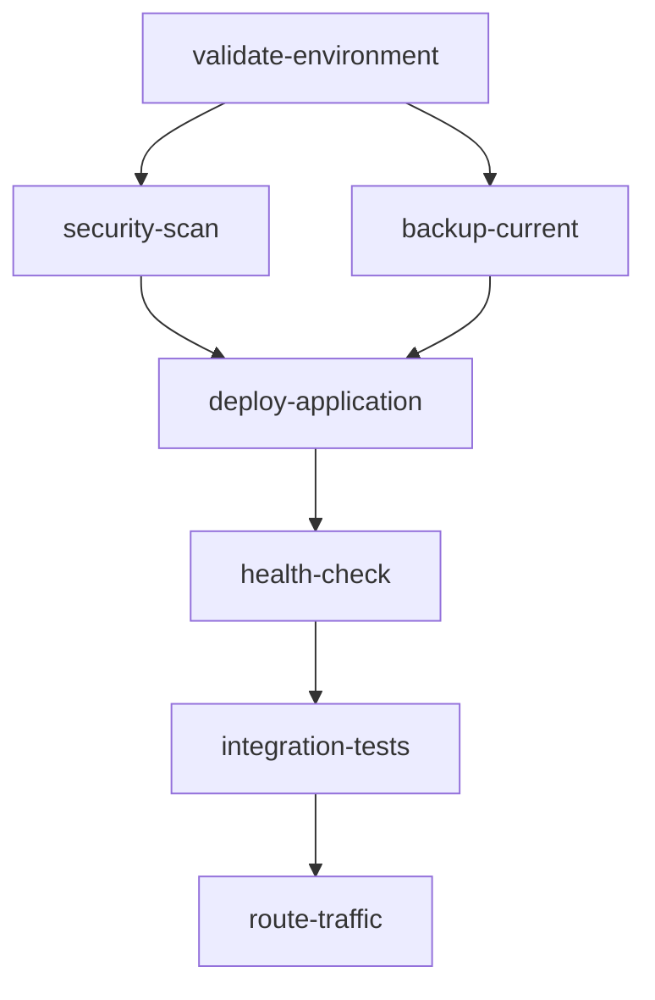
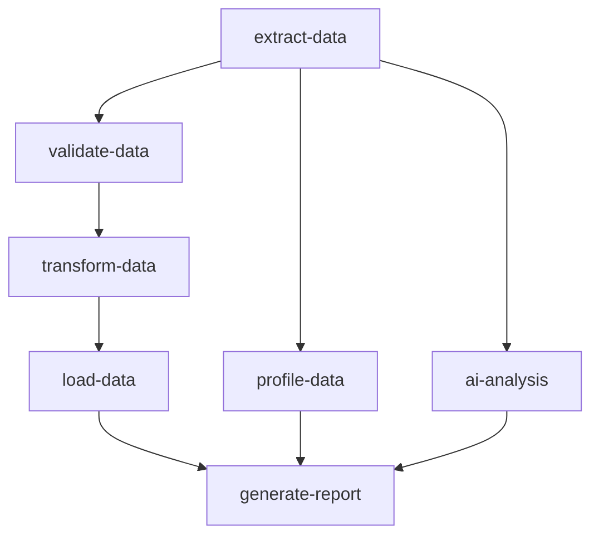

# YAML Workflow Engine Example

A powerful demonstration of **recipe-based workflow execution** using YAML definitions. This example shows how to define, load, validate, and execute complex workflows with dependency management, parallel execution, variable substitution, and AI enhancements.

## 🎯 What This Example Demonstrates

### Core Workflow Capabilities

- **📄 YAML-Defined Workflows**: Define workflows as human-readable "recipes"
- **🔗 Dependency Management**: Steps execute in proper order with dependency tracking
- **⚡ Parallel Execution**: Run independent steps simultaneously for efficiency
- **🔄 Variable Substitution**: Dynamic parameter and variable replacement
- **🧠 AI Enhancement**: AI-powered workflow analysis and optimization
- **📊 Real-time Monitoring**: Track workflow execution progress in real-time
- **✅ Validation**: Comprehensive workflow definition validation
- **🎭 Success/Failure Handling**: Automatic execution of post-workflow actions

### Example Workflow Types Included

1. **🚀 Software Deployment** - Complete CI/CD pipeline with validation, security scanning, and rollback
2. **📊 Data Processing Pipeline** - ETL workflow with quality checks and AI analysis  
3. **👥 Customer Onboarding** - Multi-step customer setup with personalization

## 🏗️ Architecture Overview

```
┌─────────────────────────────────────────────────────────────────┐
│                    YAML Workflow Engine                         │
├─────────────────────────────────────────────────────────────────┤
│  ┌──────────────┐  ┌──────────────┐  ┌──────────────────────┐  │
│  │   YAML       │  │  Validation  │  │    Execution         │  │
│  │   Parser     │  │   Engine     │  │    Engine           │  │
│  │              │  │              │  │                      │  │
│  │ • Load YAML  │  │ • Syntax     │  │ • Dependency Mgmt   │  │
│  │ • Parse      │  │ • Logic      │  │ • Parallel Exec     │  │
│  │ • Variables  │  │ • Dependencies│  │ • Variable Subst   │  │
│  └──────────────┘  └──────────────┘  └──────────────────────┘  │
├─────────────────────────────────────────────────────────────────┤
│                     Workflow Definitions                        │
│  ┌──────────────┐  ┌──────────────┐  ┌──────────────────────┐  │
│  │ Deployment   │  │ Data Pipeline│  │  Onboarding         │  │
│  │ Workflow     │  │ Workflow     │  │  Workflow           │  │
│  │              │  │              │  │                      │  │
│  │ 6 steps      │  │ 7 steps      │  │ 6 steps            │  │
│  │ Blue-green   │  │ ETL + AI     │  │ AI Personalization │  │
│  │ Rollback     │  │ Quality      │  │ Resource Setup     │  │
│  └──────────────┘  └──────────────┘  └──────────────────────┘  │
├─────────────────────────────────────────────────────────────────┤
│                    Execution Monitoring                         │
│   Real-time Status • Progress Tracking • Error Handling       │
└─────────────────────────────────────────────────────────────────┘
```

## 🚀 Quick Start

### Prerequisites

- Go 1.21 or later
- OpenAI API key (for AI-enhanced workflows)
- Redis (optional, for service discovery)
- Docker (optional, for containerized deployment)

### 1. Local Development Setup

```bash
# Navigate to the workflow example
cd examples/workflow-example

# Install dependencies  
go mod tidy

# Set up environment variables
export OPENAI_API_KEY="your-openai-api-key-here"
export AI_PROVIDER="openai"
export AI_MODEL="gpt-4"

# Optional: Configure Redis for service discovery
export REDIS_URL="redis://localhost:6379"

# Run the workflow engine
go run main.go
```

The service will start and automatically create example workflows:

```
2024/01/15 10:30:00 Starting YAML Workflow Engine on port 8080
2024/01/15 10:30:00 Loading workflow definitions from directory: ./workflows
2024/01/15 10:30:00 Created example workflow: software-deployment.yaml
2024/01/15 10:30:00 Created example workflow: data-processing-pipeline.yaml  
2024/01/15 10:30:00 Created example workflow: customer-onboarding.yaml
2024/01/15 10:30:00 Loaded workflow: software-deployment (version 1.0.0) with 6 steps
2024/01/15 10:30:00 Loaded workflow: data-processing-pipeline (version 2.1.0) with 7 steps
2024/01/15 10:30:00 Loaded workflow: customer-onboarding (version 1.5.0) with 6 steps
2024/01/15 10:30:00 Loaded 3 workflow definitions from ./workflows

Available endpoints:
  GET  /health - Service health check
  GET  /workflows - List available workflows
  GET  /workflows/:name - Get workflow definition
  POST /workflows/:name/execute - Execute workflow
  GET  /executions/:id - Monitor execution
  POST /workflows/validate - Validate workflow YAML
  POST /workflows/reload - Reload workflows from disk

Workflow capabilities:
  - YAML-defined workflow recipes
  - Dependency management and parallel execution  
  - Variable substitution and parameterization
  - AI-enhanced workflow execution
  - Real-time execution monitoring
  - Success/failure action handling
```

### 2. Docker Deployment

```bash
# Build the Docker image
docker build -t gomind/yaml-workflow-engine:latest .

# Run with environment variables
docker run -d \
  --name workflow-engine \
  -p 8080:8080 \
  -p 9090:9090 \
  -e OPENAI_API_KEY="your-key-here" \
  -e AI_PROVIDER="openai" \
  -v $(pwd)/workflows:/app/workflows \
  gomind/yaml-workflow-engine:latest
```

### 3. Kubernetes Deployment

```bash
# Update secrets in k8-deployment.yaml with your API keys
kubectl apply -f k8-deployment.yaml

# Check deployment status
kubectl get pods -n gomind-workflow

# Access via port-forward
kubectl port-forward svc/workflow-engine-service 8080:80 -n gomind-workflow
```

## 📋 YAML Workflow Format

### Basic Workflow Structure

```yaml
name: "my-workflow"
version: "1.0.0"
description: "Description of what this workflow does"
author: "Your Name"
tags: ["category", "type"]

config:
  mode: "sequential"        # sequential, parallel, mixed
  timeout: "30m"           # Overall workflow timeout
  max_parallel: 3         # Max parallel steps
  continue_on_error: false # Whether to continue if a step fails
  ai_enhanced: true       # Enable AI enhancements
  retry:
    max_attempts: 2
    delay: "30s"
    backoff: "exponential"

parameters:
  param_name:
    type: "string"          # string, int, bool, object
    description: "Parameter description"
    required: true
    default: "default_value"

variables:
  var_name: "value"
  computed_var: "${param_name}-${timestamp}"

steps:
  - id: "step-1"
    name: "Human Readable Step Name"
    type: "agent"           # agent, tool, ai, http, script
    agent: "agent-name"
    instruction: "What the agent should do with ${param_name}"
    depends_on: []          # List of step IDs this depends on
    input:
      key: "value"
    output:
      result_var: "response_field"
    config:
      timeout: "5m"
      required: true

on_success:
  - id: "success-action"
    name: "Success Action"
    type: "agent"
    agent: "notification-agent"
    instruction: "Send success notification"

on_failure:
  - id: "failure-action"  
    name: "Failure Action"
    type: "agent"
    agent: "cleanup-agent"
    instruction: "Clean up failed workflow resources"
```

## 📖 Usage Examples

### 1. List Available Workflows

```bash
curl http://localhost:8080/workflows
```

**Response:**
```json
{
  "workflows": {
    "software-deployment": {
      "name": "software-deployment",
      "version": "1.0.0", 
      "description": "Complete software deployment workflow with validation, testing, and rollback",
      "steps_count": 6,
      "ai_enhanced": true,
      "mode": "mixed"
    },
    "data-processing-pipeline": {
      "name": "data-processing-pipeline",
      "version": "2.1.0",
      "description": "ETL pipeline for processing customer data with AI analysis",
      "steps_count": 7,
      "ai_enhanced": true,
      "mode": "parallel"
    }
  },
  "total": 2
}
```

### 2. Execute Software Deployment Workflow

```bash
curl -X POST http://localhost:8080/workflows/software-deployment/execute \
  -H "Content-Type: application/json" \
  -d '{
    "parameters": {
      "application_name": "user-service",
      "environment": "production", 
      "version": "v2.1.0",
      "enable_rollback": true
    }
  }'
```

**Workflow Execution Flow:**
```
1. ✅ validate-environment (2m) 
2. 🔄 security-scan (5m) | backup-current (8m)  [Parallel]
3. ✅ deploy-application (12m) [Waits for both above]
4. ✅ health-check (2m)
5. ✅ integration-tests (10m)  
6. ✅ route-traffic (3m)
7. 🎉 Success Actions: cleanup + notification
```

**Response:**
```json
{
  "id": "software-deployment-1642271234",
  "workflow_id": "software-deployment",
  "status": "completed",
  "start_time": "2024-01-15T10:30:00Z",
  "duration": "25m30s",
  "total_steps": 6,
  "completed_steps": 6,
  "failed_steps": 0,
  "parameters": {
    "application_name": "user-service",
    "environment": "production",
    "version": "v2.1.0"
  },
  "result": "Deployment completed successfully"
}
```

### 3. Execute Data Processing Pipeline

```bash
curl -X POST http://localhost:8080/workflows/data-processing-pipeline/execute \
  -H "Content-Type: application/json" \
  -d '{
    "parameters": {
      "data_source": "customer_db",
      "target_date": "2024-01-15",
      "quality_threshold": 90,
      "enable_ai_analysis": true
    }
  }'
```

**Parallel Execution Flow:**
```
1. ✅ extract-data (15m)
2. 🔄 validate-data | profile-data | ai-analysis [All Parallel after extract]
3. ✅ transform-data (20m) [Waits for validation]
4. ✅ load-data (10m)
5. ✅ generate-report (5m) [Waits for all components]
```

### 4. Monitor Workflow Execution

```bash
curl http://localhost:8080/executions/software-deployment-1642271234
```

**Real-time Status:**
```json
{
  "execution_id": "software-deployment-1642271234",
  "workflow_id": "software-deployment", 
  "status": "running",
  "progress_percent": 66.7,
  "start_time": "2024-01-15T10:30:00Z",
  "duration": "15m20s",
  "total_steps": 6,
  "completed_steps": 4,
  "failed_steps": 0,
  "current_steps": ["integration-tests"],
  "errors": []
}
```

### 5. Validate Custom Workflow

```bash
curl -X POST http://localhost:8080/workflows/validate \
  -H "Content-Type: application/json" \
  -d '{
    "yaml_content": "name: \"test\"\nversion: \"1.0.0\"\nsteps:\n  - id: \"step1\"\n    name: \"Test Step\"\n    type: \"agent\"\n    agent: \"test-agent\"\n    instruction: \"Test instruction\""
  }'
```

**Validation Response:**
```json
{
  "valid": true,
  "workflow": "test",
  "version": "1.0.0", 
  "steps_count": 1,
  "warnings": ["No timeout specified for workflow"]
}
```

## 🎨 Example Workflows Deep Dive

### 1. Software Deployment Workflow

**File**: `workflows/software-deployment.yaml`

**Key Features:**
- **Blue-Green Deployment Strategy**
- **Parallel Security Scanning & Backup**
- **Automatic Rollback on Failure**
- **Integration Testing Pipeline**
- **Progressive Traffic Routing**

**Step Dependencies:**


**Parameters:**
- `application_name` (required): Application to deploy
- `environment` (required): Target environment  
- `version` (required): Version to deploy
- `enable_rollback` (default: true): Enable automatic rollback

### 2. Data Processing Pipeline

**File**: `workflows/data-processing-pipeline.yaml`

**Key Features:**
- **Parallel ETL Processing**
- **AI-Powered Data Analysis**
- **Quality Score Validation**
- **Comprehensive Data Profiling**
- **Automated Reporting**

**Parallel Execution Pattern:**


**AI Enhancement:**
- Analyzes data patterns and anomalies
- Provides insights on data quality
- Suggests optimization opportunities

### 3. Customer Onboarding Workflow

**File**: `workflows/customer-onboarding.yaml`

**Key Features:**
- **AI-Powered Personalization**
- **Tier-Based Resource Provisioning**
- **Integration Configuration**
- **Automated Training Scheduling**
- **Success Team Notification**

**Conditional Execution:**
```yaml
steps:
  - id: "schedule-training"
    condition: "${customer_tier} in ['premium', 'enterprise']"
    # Only runs for premium/enterprise customers
```

## 🔧 Advanced Features

### Variable Substitution

**System Variables:**
- `${timestamp}` - Current Unix timestamp
- `${execution_id}` - Unique execution ID

**Parameter Variables:**
```yaml
parameters:
  app_name:
    type: "string"
    required: true

variables:
  deployment_id: "${app_name}-${version}-${timestamp}"
  backup_path: "/backups/${deployment_id}"

steps:
  - instruction: "Deploy ${app_name} to backup location ${backup_path}"
```

### Conditional Execution

```yaml
steps:
  - id: "optional-step"
    condition: "${enable_feature} == true"
    # Only executes if condition is met
    
  - id: "tier-specific"
    condition: "${customer_tier} in ['premium', 'enterprise']"
    # Executes for specific tiers only
```

### Retry Configuration

```yaml
config:
  retry:
    max_attempts: 3
    delay: "30s"
    backoff: "exponential"  # linear, exponential

steps:
  - id: "retryable-step"
    config:
      retry:
        max_attempts: 5  # Override global setting
        delay: "1m"
```

### Success/Failure Actions

```yaml
on_success:
  - id: "cleanup"
    type: "agent"
    agent: "cleanup-agent"
    instruction: "Clean up temporary resources"
    
  - id: "notify"
    type: "agent"
    agent: "notification-agent"
    instruction: "Send success notification to ${notification_channels}"

on_failure:
  - id: "rollback"
    type: "agent"
    agent: "rollback-agent"
    instruction: "Rollback changes and restore previous state"
    condition: "${enable_rollback} == true"
```

### AI Enhancement

```yaml
config:
  ai_enhanced: true

# AI automatically:
# 1. Analyzes workflow complexity
# 2. Suggests optimizations
# 3. Provides intelligent error analysis
# 4. Enhances step instructions based on context
```

## 📊 Monitoring and Observability

### Real-time Execution Tracking

Monitor workflow progress with detailed step-by-step tracking:

```bash
# Get execution status
curl http://localhost:8080/executions/{execution-id}

# Response includes:
# - Overall progress percentage
# - Individual step status  
# - Current running steps
# - Error details
# - Performance metrics
```

### Workflow Analytics

```bash
curl http://localhost:8080/analytics
```

**Analytics Include:**
- Execution success rates
- Average execution times
- Popular workflow patterns  
- Error frequency analysis
- Resource utilization metrics

### Health Checks

```bash
curl http://localhost:8080/health
```

**Health Response:**
```json
{
  "status": "healthy",
  "service": "yaml-workflow-engine",
  "workflows": 3,
  "executions": 2,
  "timestamp": "2024-01-15T10:30:00Z"
}
```

## 🔄 Workflow Management

### Hot Reload Workflows

Update workflows without restarting the service:

```bash
# Edit workflow files in ./workflows/
# Then reload
curl -X POST http://localhost:8080/workflows/reload
```

### Dynamic Workflow Loading

Place new YAML files in the `./workflows/` directory and they'll be automatically loaded on startup or reload.

### Workflow Versioning

```yaml
name: "my-workflow"
version: "2.1.0"  # Semantic versioning
description: "Updated workflow with new features"
```

## 🧪 Testing Workflows

### Dry Run Mode

Test workflows without actually executing them:

```bash
curl -X POST http://localhost:8080/workflows/software-deployment/execute \
  -H "Content-Type: application/json" \
  -d '{
    "parameters": {"application_name": "test-app"},
    "dry_run": true
  }'
```

**Dry Run Response:**
```json
{
  "dry_run": true,
  "message": "Workflow validation successful - would execute successfully",
  "estimated_duration": "15-25 minutes",
  "execution": {
    "steps": {...}  // Simulated step execution
  }
}
```

### Workflow Validation

Validate YAML syntax and logic before execution:

```bash
curl -X POST http://localhost:8080/workflows/validate \
  -H "Content-Type: application/json" \
  -d '{"yaml_content": "..."}'
```

## 🎯 Creating Custom Workflows

### 1. Define Your Workflow

Create a new YAML file in `./workflows/`:

```yaml
# workflows/my-custom-workflow.yaml
name: "my-custom-workflow"
version: "1.0.0"
description: "Custom workflow for my specific use case"

config:
  mode: "sequential"
  timeout: "15m"
  ai_enhanced: true

parameters:
  target_env:
    type: "string"
    required: true
    description: "Target environment"

steps:
  - id: "step-1"
    name: "First Step"
    type: "agent"
    agent: "my-agent"
    instruction: "Execute first step for ${target_env}"
    
  - id: "step-2"
    name: "Second Step"
    type: "agent"
    agent: "my-other-agent"
    instruction: "Execute second step"
    depends_on: ["step-1"]
```

### 2. Reload and Test

```bash
# Reload workflows
curl -X POST http://localhost:8080/workflows/reload

# Validate your workflow
curl -X POST http://localhost:8080/workflows/validate \
  -H "Content-Type: application/json" \
  -d '{"yaml_content": "..."}'

# Execute your workflow
curl -X POST http://localhost:8080/workflows/my-custom-workflow/execute \
  -H "Content-Type: application/json" \
  -d '{"parameters": {"target_env": "staging"}}'
```

## 🔧 Configuration Options

### Environment Variables

| Variable | Description | Default | Required |
|----------|-------------|---------|----------|
| `WORKFLOWS_DIR` | Directory containing YAML workflows | `./workflows` | No |
| `MAX_PARALLEL_WORKFLOWS` | Max concurrent workflow executions | `5` | No |
| `DEFAULT_WORKFLOW_TIMEOUT` | Default workflow timeout | `30m` | No |
| `ENABLE_AI_ENHANCEMENT` | Enable AI workflow enhancements | `true` | No |
| `OPENAI_API_KEY` | OpenAI API key for AI features | - | Yes (for AI) |
| `AI_PROVIDER` | AI provider | `openai` | No |
| `AI_MODEL` | AI model to use | `gpt-4` | No |
| `PORT` | HTTP server port | `8080` | No |

### Workflow Engine Configuration

```go
engine := &YAMLWorkflowEngine{
    templatesDir:        "./workflows",
    workflowDefinitions: make(map[string]*WorkflowDefinition),
    activeExecutions:    make(map[string]*WorkflowExecution),
    executionHistory:    make([]orchestration.ExecutionRecord, 0),
}
```

## 📈 Performance Characteristics

### Execution Performance
- **Sequential Workflows**: Linear execution time based on step count
- **Parallel Workflows**: Reduced execution time with proper parallelization
- **Mixed Workflows**: Optimized execution combining both approaches

### Scalability Features
- **Concurrent Executions**: Multiple workflows can run simultaneously
- **Resource Limits**: Configurable concurrency and timeout limits
- **Memory Management**: Efficient workflow definition caching
- **Horizontal Scaling**: Stateless design supports multiple instances

### Resource Usage
- **Memory**: ~50MB base + ~5MB per active workflow
- **CPU**: Low baseline, spikes during AI analysis
- **Storage**: Minimal (workflow definitions only)

## 🔍 Troubleshooting

### Common Issues

1. **Workflow Not Found**
   ```
   Error: "workflow 'xyz' not found"
   Solution: Check GET /workflows to see available workflows
   ```

2. **Parameter Validation Failed**
   ```
   Error: "required parameter 'param_name' is missing"
   Solution: Provide all required parameters in the execution request
   ```

3. **Dependency Cycle Detected**
   ```
   Error: "step A depends on non-existent step: B"
   Solution: Fix step dependencies in your YAML workflow
   ```

4. **AI Enhancement Unavailable**
   ```
   Warning: "AI client initialization failed"
   Solution: Set OPENAI_API_KEY environment variable
   ```

### Debug Mode

```bash
# Enable debug logging
export LOG_LEVEL=debug
go run main.go

# Check workflow loading
export WORKFLOWS_DIR=/path/to/your/workflows
```

### Workflow Validation

Use the validation endpoint to check your workflows before execution:

```bash
# Validate workflow syntax
curl -X POST http://localhost:8080/workflows/validate \
  -d '{"yaml_content": "..."}'

# Check for warnings
# Look for dependency issues
# Verify parameter definitions
```

## 🚀 Advanced Use Cases

### 1. CI/CD Pipeline Integration

```yaml
name: "cicd-pipeline"
steps:
  - id: "build"
    type: "agent"
    agent: "build-agent"
    
  - id: "test"
    type: "agent" 
    agent: "test-agent"
    depends_on: ["build"]
    
  - id: "deploy-staging"
    depends_on: ["test"]
    
  - id: "integration-tests"
    depends_on: ["deploy-staging"]
    
  - id: "deploy-production"
    depends_on: ["integration-tests"]
    condition: "${branch} == 'main'"
```

### 2. Data Pipeline Orchestration

```yaml
name: "etl-pipeline"
config:
  mode: "parallel"
  max_parallel: 5

steps:
  - id: "extract-source-a"
    type: "agent"
    agent: "extraction-agent"
    
  - id: "extract-source-b"
    type: "agent"
    agent: "extraction-agent"
    
  - id: "transform-data"
    depends_on: ["extract-source-a", "extract-source-b"]
    
  - id: "quality-check"
    depends_on: ["transform-data"]
    
  - id: "load-warehouse"
    depends_on: ["quality-check"]
```

### 3. Incident Response Automation

```yaml
name: "incident-response"
config:
  ai_enhanced: true
  
parameters:
  incident_type:
    type: "string"
    required: true
    
steps:
  - id: "analyze-incident"
    type: "ai"
    instruction: "Analyze incident type ${incident_type} and suggest response steps"
    
  - id: "execute-response"
    depends_on: ["analyze-incident"]
    instruction: "Execute response plan based on AI analysis"
```

## 🤝 Contributing

This example demonstrates comprehensive workflow orchestration patterns. To extend:

1. **Add Custom Step Types**: Implement new step execution types
2. **Enhanced AI Integration**: Improve AI analysis and optimization  
3. **Monitoring Dashboard**: Build real-time workflow monitoring UI
4. **Workflow Library**: Create domain-specific workflow templates

## 📚 Related Examples

- **[Orchestration Example](../orchestration-example/)** - Multi-modal orchestration patterns
- **[Agent Example](../agent-example/)** - Basic agent coordination
- **[AI Agent Example](../ai-agent-example/)** - AI-first architecture
- **[Tool Example](../tool-example/)** - Component tool patterns

## 🆘 Support

- **Framework Documentation**: [GoMind Docs](../../docs/)
- **Workflow Best Practices**: See example workflows in `./workflows/`
- **Issue Tracking**: Create issues in the main repository
- **Community**: Join discussions about workflow patterns

---

**Built with ❤️ using the GoMind Framework**  
*Empowering workflow automation through YAML recipes*